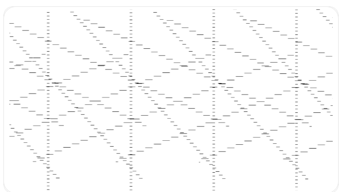
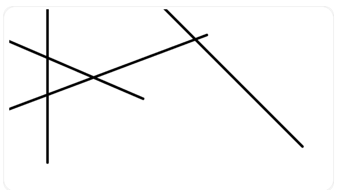

# screen-capture-pixel-buffers domain

**螢幕擷取拿到的不是「一張圖」，是一塊有排版規則的記憶體。看不懂那個排版就會做出
斜掉的截圖 —— 而且不會有任何錯誤訊息。**

由 VB-2335（Store 版 Quiz Tool 的題目圖顯示異常）整理。程式碼在 ragdoll-cat 的
`ImageUtil.bufferToBitmap` 與它的兩個呼叫端；這份文件只講**觀念**，不複製實作。

| 段落 | 回答什麼 |
|---|---|
| [一張圖在記憶體裡長什麼樣](#一張圖在記憶體裡長什麼樣) | pixel / 通道 / 列，最基本的東西 |
| [ImageReader、Image、Plane](#imagereaderimageplane-這三個名詞) | 這三個名詞各是什麼、誰給誰 |
| [pixelStride 與 rowStride](#pixelstride-與-rowstride) | 兩個 stride 分別是什麼、為什麼會有多餘的位元組 |
| [壞掉的時候長什麼樣](#壞掉的時候長什麼樣) | 為什麼是「斜的」而不是「花的」 |
| [為什麼只有 Store 版會中](#為什麼只有-store-版會中) | 同一份程式碼，IFP 沒事 |
| [正確的做法](#正確的做法) | 兩種寫法，其中一種是陷阱 |
| [自己要怎麼驗](#自己要怎麼驗) | 判準與探針 |

---

## 一張圖在記憶體裡長什麼樣

一張點陣圖（bitmap）說穿了就是**一長條位元組**，外加「怎麼把它折行」的規則。

一個 **pixel**（像素）＝畫面上的一個點。彩色點要記顏色，最常見的記法是 4 個**通道**
（channel），各佔 1 個位元組：

```
R (紅) G (綠) B (藍) A (透明度)   →  4 bytes = 32 bits
```

這就是 `RGBA_8888` 這個名字的意思：R/G/B/A 四個通道、每個 8 bits。Android 的
`Bitmap.Config.ARGB_8888` 是同一件事，只是通道順序的寫法不同。

一張 6×4 的圖，理想上就是 24 個 pixel 排成一條：

```
列 0: [p0 ][p1 ][p2 ][p3 ][p4 ][p5 ]
列 1: [p6 ][p7 ][p8 ][p9 ][p10][p11]
列 2: [p12][p13][p14][p15][p16][p17]
列 3: [p18][p19][p20][p21][p22][p23]
```

在記憶體裡它們是**連續**的一條，沒有真的「換行」——換行只是讀的人自己數「每 6 個
pixel 算一列」。**這個「每幾個算一列」的數字如果數錯，整張圖就會歪掉。** 本文的整個
故事都是這一句話的展開。

---

## ImageReader、Image、Plane 這三個名詞

擷取螢幕時，畫面是**別人（系統合成器 / GPU）畫好的**，我們只是去領。Android 的領法是：

```
MediaProjection ──建立──▶ VirtualDisplay ──把畫面畫進──▶ Surface
                                                           │
                                                    (Surface 由 ImageReader 提供)
                                                           ▼
                                                      ImageReader
                                                           │ acquireLatestImage()
                                                           ▼
                                                        Image
                                                           │ planes[0]
                                                           ▼
                                                     Image.Plane
                                                           │ .buffer
                                                           ▼
                                                      ByteBuffer  ← 真正的位元組在這
```

| 名詞 | 是什麼 | 白話 |
|---|---|---|
| **MediaProjection** | 使用者授權後拿到的「可以錄螢幕」憑證 | 那個「要開始錄製或投放內容嗎？」按下去得到的東西 |
| **VirtualDisplay** | 一塊虛擬螢幕，系統會把真螢幕的內容鏡射上去 | 「把螢幕再畫一份到我指定的地方」 |
| **Surface** | 畫面的收件匣 | VirtualDisplay 把畫面畫進來的地方 |
| **ImageReader** | 收件匣後面的信箱，會把收到的畫面存成一格一格的 frame | 我們跟它要 frame |
| **Image** | 一個 frame | 「某一瞬間的螢幕」 |
| **Plane** | frame 裡的**一個平面** | 見下段 |

### 為什麼是 `planes[0]` 而不是 `image.bytes`

有些影像格式**不會**把一個 pixel 的所有資料放在一起。影片常見的 `YUV_420_888` 就是把
亮度（Y）、兩個色度（U、V）**分開放三塊**，而且色度的解析度只有亮度的一半——因為人眼
對亮度敏感、對顏色不敏感，這樣可以省一半以上的資料量。

那三塊各自就是一個 **plane**（平面）。所以 API 設計成 `image.planes` 是一個陣列。

**`RGBA_8888` 只有一個 plane**（四個通道交錯放在一起），所以固定取 `planes[0]`。
看到 `planes[0]` 不用緊張，它不是什麼魔法索引，就是「這個格式只有一塊」。

---

## pixelStride 與 rowStride

**stride ＝ 跨幅 ＝ 從一個東西的開頭，走幾個位元組會到下一個的開頭。** 兩種跨幅：

| 名稱 | 定義 | `RGBA_8888` 的值 |
|---|---|---|
| `pixelStride` | 同一列裡，**下一個 pixel** 的開頭離我幾個 byte | **4**（RGBA 各 1 byte） |
| `rowStride` | **下一列**的開頭離這一列的開頭幾個 byte | **不一定** ← 重點 |

直覺會覺得 `rowStride` 就是 `width × pixelStride`。**很多時候不是。**

### 為什麼 rowStride 會比較大

GPU 讀寫記憶體時，如果每一列的起點都落在整齊的邊界上（例如 256 的倍數），速度會快很多。
所以驅動程式配置緩衝區時，會把每一列**補齊**到對齊邊界，補的那幾個 byte 沒有任何內容，
純粹是墊檔。這段墊檔叫 **padding**（列尾填充）。

VB-2335 的實測（Galaxy Tab S7 FE，螢幕 2560×1600）：

```
w=2560  h=1600  pixelStride=4  rowStride=11264  bufferCapacity=18022400
```

- 有效資料：`2560 × 4 = 10240` bytes／列
- 實際跨幅：`11264` bytes／列
- **padding：`11264 − 10240 = 1024` bytes ＝ 256 個 pixel 的寬度**

畫成圖（`▒` 是 padding）：

```
     ←──────────── rowStride = 11264 bytes ────────────→
     ←─── 有效 10240 bytes（2560 px）───→←─ 1024 ─→
列 0 [████████████████████████████████████][▒▒▒▒▒▒▒]
列 1 [████████████████████████████████████][▒▒▒▒▒▒▒]
列 2 [████████████████████████████████████][▒▒▒▒▒▒▒]
 ...
```

> ⚠️ **padding 是不是 0，不能從螢幕寬度推算。** 2560 看起來「很整齊」（是 256 的倍數），
> 但這台機器照樣補了 1024 bytes。決定權在 GPU 驅動，換一台機器、換一版驅動都可能不同。
> 所以「我這台看起來沒事」**不是**結論。

---

## 壞掉的時候長什麼樣

`Bitmap.copyPixelsFromBuffer(buffer)` 的行為很單純：**從 buffer 目前位置開始，一路連續讀，
填滿這張 Bitmap 需要的 `width × height × 4` 個 byte。** 它不知道 stride，也不會問。

所以當程式寫成

```
建一張 2560×1600 的 Bitmap，然後把整個 buffer 倒進去
```

Bitmap 每讀滿 10240 bytes 就認為「一列結束、換下一列」，但來源其實每 11264 bytes 才換列。
於是：

- 第 0 列：正確
- 第 1 列：從來源的第 10240 byte 開始讀 → **比正確位置早了 1024 bytes**，內容是上一列的
  padding 加上這一列的開頭 → 整列**往右位移 256 px**
- 第 2 列：位移 512 px
- 第 n 列：位移 `n × 256` px，超過寬度就繞回來

累積下來就是**逐列遞增的斜向錯位**，而且因為位移量會繞圈，同一個內容會在畫面上**重複出現好幾次**。

實際長這樣（畫布上本來只有四條直線）：



修好之後：



### 為什麼它不會報錯 —— 這才是最麻煩的地方

`copyPixelsFromBuffer` **只在 buffer 比 Bitmap 需要的還小時**才丟例外。

padding 只會讓 buffer **變大**（18022400 > 16384000），所以：

- 不會有例外
- 不會有 log
- 不會有 crash
- build 一路成功、測試全綠

**唯一的徵兆是使用者看到的那張圖。** 這就是為什麼它撐到 QA 才被抓到。

> 這是 [`cross-system-claims.md`](../../../.claude/rules/cross-system-claims.md) §5「工具語意的
> 沉默陷阱」的標準形狀：**回傳了一個合法的值，只是那個值是錯的。**

---

## 為什麼只有 Store 版會中

同一份 ClassSwift 程式碼，IFP 出貨的版本沒事。因為**擷取螢幕有兩條路**：

| 路徑 | 誰在用 | 怎麼拿到畫面 |
|---|---|---|
| **VSApi** | IFP（`ifp` / `edla` flavor，AOSP 客製韌體） | `VSPictureManager.screenshot()` **直接回傳一張 Bitmap** —— 沒有 buffer、沒有 stride、不需要使用者同意 |
| **MediaProjection** | Google Play 線（`store` flavor：平板、Chromebook） | 上面整套 VirtualDisplay → ImageReader → Plane → ByteBuffer |

stride 這個概念**只存在於第二條路**。IFP 拿到的已經是組好的 Bitmap，系統幫你處理完了。

所以這個 bug 的形狀是：**平台能力較強的機器幫你把問題藏起來，較弱的機器才暴露它。**
單子標題寫 Chromebook、實際上任何走 MediaProjection 的機器都可能中。

> 這也是 [`cross-system-claims.md`](../../../.claude/rules/cross-system-claims.md) §1
> 「不要把 A 系統的慣例外推到 B」的實例：「IFP 上這段程式碼跑了兩年沒事」對 store 完全不是證據。

---

## 正確的做法

### 核心：逐列搬，每列只搬有效的那幾個 byte

```
for 每一列 y:
    從 buffer 的第 (y × rowStride) 個 byte 開始
    讀 (width × pixelStride) 個 byte
    貼到目的地的第 (y × width × pixelStride) 個 byte
```

padding 從頭到尾沒被碰過。

### ⚠️ 陷阱：「配一張寬一點的 Bitmap 整個吃下去，再裁掉」

這是網路上最常見的寫法，看起來更漂亮：

```
配一張 (width + padding寬度) × height 的 Bitmap
整個 buffer 倒進去      ← 每列自動對齊，因為 Bitmap 的寬度就等於 rowStride
再裁成 width × height
```

**畫面結果是對的，但它會在某些裝置上整個擷取失敗。**

因為這種寫法需要 `rowStride × height` 個 byte，而 Android 的
[`Image.Plane.getBuffer()`](https://developer.android.com/reference/android/media/Image.Plane#getBuffer())
文件寫得很清楚（逐字）：

> For raw formats, each plane is only guaranteed to contain data up to the last pixel in the last
> row. In other words, **the stride after the last row may not be mapped into the buffer.**

也就是**保證的最小長度只有**：

```
(height − 1) × rowStride  +  width × pixelStride
```

最後一列後面那段 padding **可以不存在**。少了它，`copyPixelsFromBuffer` 就會因為
「buffer 不夠大」丟 `RuntimeException` —— 這次是真的會炸，而且只炸在給最小值的那些裝置上。

我們這台實測 `bufferCapacity = 11264 × 1600`（給滿了），所以在這台機器上**測不出這個差別**。
逐列搬的寫法最遠只碰到上面那個保證值，兩種裝置都安全。

> 這條是 `/review-local` 的子程序抓到的，我自己第一版就是踩這個陷阱。

---

## 自己要怎麼驗

### 探針：把四個數字全印出來，而且每個都要解釋得通

```
w=? h=? pixelStride=? rowStride=? bufferCapacity=?
```

拿到之後逐項對帳：

| 檢查 | 這次的實際值 |
|---|---|
| `width × pixelStride` 等於 `rowStride` 嗎？ | `10240 ≠ 11264` → **有 padding** |
| `bufferCapacity` 等於 `rowStride × height` 嗎？ | `18022400 = 11264 × 1600` → 這台給滿了 |
| padding 換算成幾個 pixel？ | `1024 / 4 = 256` px |

**不要只看你要找的那一項。** 每個數字都要解釋得出來，解釋不了就代表你還沒懂發生什麼事
（見 `cross-system-claims.md` §5「探針輸出的每一項都要能解釋」）。

### 單元測試要蓋三種輸入，不是一種

fallback 與 padding 這類分支幾乎總是有多個觸發組合，只測一種是最常見的漏法：

| 情境 | 為什麼要單獨測 |
|---|---|
| `rowStride == width × pixelStride` | 沒有 padding 的機器不可以因為修正而變樣 |
| `rowStride > width × pixelStride`，buffer 給滿 | 主要情境，驗 padding 真的被裁掉 |
| `rowStride > width × pixelStride`，buffer 只到最後一個 pixel | 驗「不去讀不保證存在的那段」 |

測試裡的來源 buffer **不要自己手寫 RGBA 位元組**——通道在記憶體裡的順序與位元組序都是
容易寫錯的假設。改用「先做一張 Bitmap，再用它自己的 `copyPixelsToBuffer` 取出逐列位元組」
來組裝，就完全不必假設編碼。

### 變異測試：每條宣稱各打一次

三條測試就要做三次變異，每次打在該條對應的那一行：

| 變異 | 應該變紅的 |
|---|---|
| 完全忽略 padding | 「padding 被裁掉」＋「最短 buffer」兩條 |
| 退回成「配寬一點再裁」 | **只有**「最短 buffer」那條 |

第二個變異只讓一條變紅，正好證明那條測試守的是別條守不到的東西。

---

## 一句話帶走

> **從系統拿到的影像緩衝區，`rowStride` 才是換列的依據，`width × pixelStride` 不是。**
> 兩者相不相等由 GPU 驅動決定，而且搞錯的時候沒有任何錯誤訊息。

---

## 相關

- [[cs]] skill — ragdoll-cat 的工作規範（擷取流程的程式碼在那裡）
- [[mvbf]] skill — fusion build 怎麼建、怎麼裝到機器上驗
- [`cross-system-claims.md`](../../../.claude/rules/cross-system-claims.md) §1 / §5 —
  「A 系統成立不代表 B 成立」與「沉默的錯誤值」，這個 bug 兩條都占
