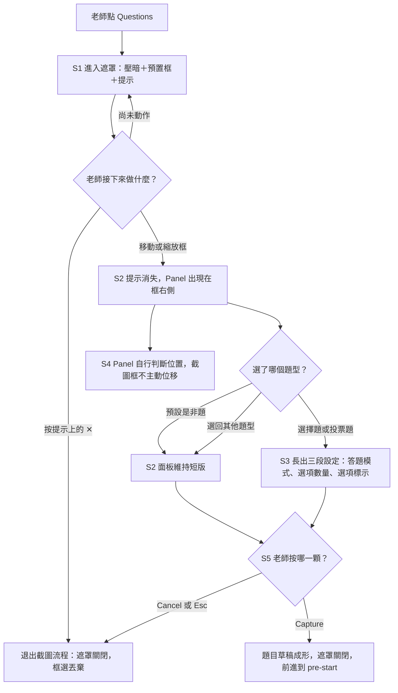

<!--
==============================================================
SOURCE TRACKING — 更新來源後請同步更新此區塊與內文
==============================================================

page_id:        606797937
url:            https://viewsonic-vsi.atlassian.net/wiki/spaces/_/pages/606797937
title:          2. Question 截圖遮罩（Scope 2）
space_id:       286228785
cloned_version: 23
cloned_at:      2026-09-03

⚠️ 本頁有「已決但線上未同步」的 AC，內文刻意保持原樣（鏡像）：
                  AC 4 / 決策 #4 的「動框後才出現」已於會議改為「碰框或碰暗區就出現」。
                  差異記在 ../../overview.html#drift，不寫進本檔。

Maintenance rule: 重新 clone 前先看 git diff，若本機有補充註解要先 commit；
                  版號與 cloned_at 一起更新，commit 訊息附來源 URL。
                  取得方式：python3 scripts/clone-atlassian.py …（見該檔 docstring）
==============================================================
-->

> | 來源頁面 | page_id | clone 版本 | clone 日期 |
> |---|---|---|---|
> | [2. Question 截圖遮罩（Scope 2）](https://viewsonic-vsi.atlassian.net/wiki/spaces/_/pages/606797937) | 606797937 | v23 | 2026-09-03 |

# 2. Question 截圖遮罩（Scope 2）

> **交付範圍：Scope 2（全頁）。** 本頁全部屬第二期。Scope 1 不動截圖遮罩 —— 第一期的老師走**現行**動線，只多了「沒有班級也能出題」與「沒有學生不能派題」兩條規則（見子頁 3）。
> 
> 🎨 **2026-08-27：本頁以 Figma 為單一真實來源。** 凡與 Figma 不符者一律以 Figma 為準，被推翻的段落保留原文並標注。
> 
> 📏 **2026-08-28（上午）**：套用新版「截圖框規格 ＋ Panel 位置規則」—— 尺寸上下限與安全邊距、**16:9 不鎖定**、**overlay 維持當前側**、**40 px 防抖動**。
> 
> 🆕 **2026-08-28（下午）PM 裁決兩條**：①**補回選項標示〔ABC｜123〕設定**（原 `Q6` 結案）；②**Cancel 改為直接關閉，不再跳確認框**（**決策 #7 反轉**，Figma 已同步移除該對話框）。
> 
> 🆕 **2026-09-01 PM 修正**：**提示上的 ✕ 是取消整個截圖流程**，不是只關掉提示（`SC-6` 改寫，決策 #6 更新）。

> 🔢 **2026-08-28：本頁 AC 編號由** `S2-xx` **改為** `SC-xx`（Screen Capture）。**數字原封不動**，舊引用直接把前綴換掉即可（`S2-15` → `SC-15`）。
> 
> **為什麼要改**：`S2-` 這個號池被子頁 2／3／4 三頁各自獨立編號，造成 **12 條同號不同義**（`S2-10`～`S2-16` 與子頁 3 相撞、`S2-17`／`S2-18`／`S2-25`～`S2-27` 與子頁 4 相撞）。子頁 3 與子頁 4 之間沒有撞號，所以**只改本頁**，另兩頁的編號維持原狀。
> 
> **不受影響**：本頁的純數字 AC（`3`／`4`／`5`／`5a`／`5b`／`17`）是跨四頁的全域舊號，本來就沒有撞號，**維持不動**。

> 🎨 **Figma 仍待補一處**：question-menu 長版**缺「選項標示」segmented（ABC／123）**那一段，面板高度會隨之增加。在設計稿補上之前，這一點**以本頁為準**。（「Close question?」對話框已依裁決自設計稿移除。）

> **數值的分工（決策 #12）**：**視覺樣式**（色票、字級、圓角、陰影、元件 token）**一律以 Figma 為準**，本頁不抄。但**行為門檻**（框的最小／最大尺寸、安全邊距、Panel 間距、防抖動緩衝）**寫在本頁** —— 它們是規則不是樣式，而且有些（例如 40 px 遲滯）在靜態設計稿上根本看不出來。

> 📐 **本頁已依 PRD normalizer 重排**：拆成 **5 個 story**，最前面一張總覽流程圖，每個 story 底下是自己的 **Given／When／Then**（三欄）與狀態覆蓋。

## 動線總覽

Diagram

## 視覺真實來源（node 對照）

Figma file `4C21d9puOZJcUyUR26oibd`（VSDS UI Design – ClassSwift Toggle）

| 畫面／元件 | node-id | 說明 |
|---|---|---|
| 空畫布（遮罩尚未啟動） | `22197:127068` | 進入前的畫面 |
| ① 框選中、面板尚未出現 | `22269:21839` | 預置框 ＋ 四角把手 ＋ Adorning Menu 提示 |
| ② 動框後、面板出現 | `22269:20290` | Panel **短版**：預設是非題，沒有設定段 |
| ③ 選了選擇題／投票題 | `22492:361313` | Panel **長版**。⚠️ **設計稿只有兩段設定，缺「選項標示」**，待補 |
| 提示（Adorning Menu 實例） | `22269:21854` | 既有元件，非新設計。⚠️ **其 ✕ 的語意是取消截圖流程**（見 `SC-6`） |

> ⚠️ `22492:359014` **是設計稿錯誤，不可作為規格依據。**
> ⚠️ 每次改版前**重新以** `get_metadata` **確認 node-id**。
> ℹ️ 原「Cancel 確認框」（`22288:89978`）已依決策 #7 反轉**自設計稿移除**。

---

# Story 1 · 進入遮罩：先給框，不給選單

> **身為**老師，
> **我希望**點下 Questions 之後馬上就能框我要出的那一塊，
> **這樣**我不用先回答「這是什麼題型」才能開始。

遮罩是**全螢幕 overlay 減去（Subtract）框的矩形** —— 框內完全透空、框外壓暗。壓暗範圍是**整個畫面**，**標題列與工具列一併被壓暗**（這是 Story 4 位置規則的前提）。

### 截圖框（Screenshot Frame）規格

| 項目 | 值 |
|---|---|
| 預設尺寸 | **748 × 421 px** |
| 預設位置 | **水平置中** |
| 預設比例 | **16:9**，⚠️ **不鎖定** —— 長寬**可獨立調整** |
| **最小寬度／高度** | **150 px ／ 150 px** |
| **最大尺寸** | **全螢幕，四邊各保留 16 px 安全邊距**；截圖內容不得超出此範圍 |

### 驗收條件

| # | Given | When | Then |
|---|---|---|---|
| **3** | toggle ON | 點 Questions | 進入遮罩：壓暗＋透空預置框（**748 × 421、水平置中、16:9**）、**四角各一顆把手**、框下方 **Adorning Menu 提示**「Drag to select an area」＋✕。**Panel 尚未出現** |
| **SC-17** | 遮罩顯示中 | 老師**把框放到最大** | 框停在**四邊距視窗邊緣各 16 px** 的位置；**不允許貼齊或超出視窗邊緣** |
| **SC-18** | 遮罩顯示中 | 老師**只拖動單一邊或單一角**，把框拉成細長或方形 | **允許** —— 16:9 只是預設值，**比例不鎖定**（受最小 150 × 150 與全螢幕安全邊距兩端限制） |
| **SC-6**（**2026-09-01 改寫**） | 提示顯示中、面板尚未出現 | 按提示上的 **✕** | **取消整個截圖流程**：遮罩關閉、回到工具列，框選一併丟棄。行為與 `SC-5`（Cancel）**完全相同**，**同樣不跳確認框** |
| **SC-6a**（反向 · **2026-09-01 改寫**） | 老師已動框，提示因此**已消失** | 老師想離開 | 此時**沒有 ✕ 可按** —— 退出改走 Panel footer 的 **Cancel**（`SC-5`）或 **Esc**（`SC-15`），三條路的結果相同 |
| **17** | 螢幕錄影進行中 | 進入遮罩 | 遮罩／框／面板／按鈕**皆可被錄影工具錄到**，且 app 自行擷取的題目圖**不含**任何遮罩元素 |
| **SC-10** | 老師接了**兩個螢幕** | 進入遮罩 | 遮罩**只出現在觸發 Questions 的那一個螢幕**上 |
| **SC-11** | 遮罩開啟中 | 解析度或螢幕排列**改變** | 框與 Panel **重新套用尺寸上下限與 Story 4 的位置規則**；**不關閉遮罩、不丟棄框選** |

> **⚠️ **`SC-6`** 於 2026-09-01 反轉，這是行為改變不是補充。**
> **舊文**：「提示消失，框與後續流程**不受影響**」—— 也就是 ✕ 只是關掉那條提示，老師仍留在遮罩裡。
> **新文**：✕ **直接退出截圖流程**，等同 Cancel。
> 若已實作成「只關提示」，這一條要改。

**備註 · 三個出口，行為一致**：`SC-6`（提示的 ✕，面板出現**前**）、`SC-5`（Cancel）、`SC-15`（Esc）—— 三者都是**直接關閉遮罩、丟棄框選、不跳確認框**。差別只在老師處於哪個階段、畫面上有哪一個可按。

**備註 · 不重入**：課中已有進行中的題目時，Questions 反灰不可點（子頁 1 `S1-32`）。

**備註 · Android 前置條件**：進入遮罩前需先判斷 **overlay ＋ 螢幕擷取權限**（子頁 1 Story 7 `S1-35`／`S1-36`）。

**狀態覆蓋 6/6**　`Happy path` `Error 不適用` `Loading 不適用` `Empty 面板尚未存在` `Boundary 150px 下限／16px 安全邊距／雙螢幕` `Interruption 提示的 ✕ 即時退出／螢幕參數改變`

---

# Story 2 · 動框之後：面板出現，題型已經有預設值

> **身為**老師，
> **我希望**框好之後選單自己出現、而且已經幫我選好一個題型，
> **這樣**我可以一路不停地做完，而不是每一步都被問一次。

| 手勢 | 行為 |
|---|---|
| 拖**邊／角**（把手） | **縮放**框（長寬可獨立調整） |
| 在框**內圈**拖移 | **移動**框 |
| 以上任一種 | 都算「**動框**」，都會讓 Panel 出現 |

### 驗收條件

| # | Given | When | Then |
|---|---|---|---|
| **4** | 遮罩初始狀態 | **移動或縮放**框 | **提示消失**（連同其 ✕），**Panel 出現在框右側**（短版）：6 顆 icon＋文字膠囊、寬度由內容決定、放不下自動換行，**預設選中 True or false**、**不顯示設定段**、**Capture 可按** |
| **5b** | 面板剛出現、老師**未改任何設定** | 直接按 Capture | 以**是非題**建立題目草稿（預設題型即是非題，不需要先點任何東西） |
| **SC-12** | 老師持續縮小框 | 寬或高**觸及 150 px** | 該方向**停止縮小**，維持在 150 px；另一個方向仍可獨立調整 |

**備註 · 退出的入口跟著換**：提示消失之後 ✕ 就不在了，離開改由 footer 的 Cancel 承接（`SC-6a`）。**任何時刻都恰好有一個可見的退出入口**。

**備註 · Capture 沒有反灰態**：題型永遠有預設值（是非題），任何時刻都可以擷取。

**備註 · **`SC-12`** 解掉的問題**：原「已知毛邊」之一 —— 框可縮到 <2pt 並被 commit，造成**靜默取消**。150 × 150 的下限讓這個狀態不存在。

**狀態覆蓋 5/6**　`Happy path` `Error 不適用` `Loading 不適用` `Empty 未選題型＝用預設值` `Boundary 150px 下限` `Interruption 提示與其 ✕ 一併消失`

---

# Story 3 · 設定段：三段設定，只有兩個題型長得出來

> **身為**老師，
> **我希望**只有在我選的題型真的需要設定時才問我，
> **這樣**面板不會為了用不到的選項一直佔著空間。

**只有選擇題與投票題有設定段**，其餘四型（含預設的是非題、Audio、Short answer、Sketch response）沒有 —— 因為只有這兩型存在「幾個選項、能不能複選、選項怎麼標」這三個問題。（決策 #9）

### 三段設定（2026-08-28 補回第三段）

| 段 | 選項 | 預設 |
|---|---|---|
| **Answer options**（答題模式） | 2 顆膠囊。**文案依題型分歧**：選擇題＝**Single-select／Multi-select**；投票題＝**Single-vote／Multi-votes** | 第一顆（單選／單票） |
| **Number of options**（選項數量） | 圓形 chip：**2 · 3 · 4 · 5 · 6** | **2** |
| **選項標示**（**2026-08-28 補回**） | segmented：**ABC ｜ 123** | **ABC**〔建議預設值 · 待確認〕 |

### 驗收條件

| # | Given | When | Then |
|---|---|---|---|
| **5** | 面板顯示中 | 選 **Multiple choice** 或 **Poll** | 面板**長出三段設定**：Answer options（預設第一顆）、Number of options（2–6，預設 2）、**選項標示（ABC／123，預設 ABC）**，變成**長版** |
| **5a**（反向） | 已長出設定段 | 改選其他四型 | **三段一起收回**，面板回到**短版**（高度變化＝內容變化，不是收合動畫） |
| **SC-31**（新增 2026-08-28） | 已選擇題或投票題、設定段顯示中 | 老師切換**選項標示**為 **123** | 選項的標示由 **A/B/C…** 改為 **1/2/3…**；**學生端作答畫面與結果頁一致採用該標示** |
| **SC-3** | 已選擇題／投票題並調整設定 | 按 Capture | **三段設定全部寫入題目草稿**並在 pre-start 的摘要 chip 上陳述；沒有設定段的題型**不被覆蓋** |
| **SC-13** | 已在選擇題調好設定（例如 4 個選項、複選、123） | 改選是非題，**再改回**選擇題 | **三段都回到預設值**（2 個選項、單選、ABC），不保留上一次的調整 |

**備註 · 選項標示的來歷**：〔ABC｜123〕原本是舊 Setting 頁三組 segmented 之一，POC 只實作了兩組，因此一度被列為未決 `Q6`（「移除是刻意還是遺漏」）。**PM 裁決 2026-08-28：補回**，`Q6` 結案。

**備註 · 待確認兩點**：①**預設值**建議為 ABC（沿用舊 Setting 頁慣例），若要改為 123 請告知；②**投票題是否同樣提供此設定** —— 本頁目前寫成兩型都有，若投票題只需要數量不需要標示，這一段要改成只在選擇題出現。

**狀態覆蓋 5/6**　`Happy path` `Error 不適用` `Loading 不適用` `Empty 四型沒有設定段` `Boundary 選項數 2–6` `Interruption 來回切換題型`

---

# Story 4 · Panel 自己找位置，截圖框不動

> **身為**老師，
> **我希望**我拖框的時候面板自己會讓開、而且不會在我手抖時左右亂跳，
> **這樣**我的注意力可以一直留在框裡的題目上。

> **前提一：Panel 為浮動元件，截圖框不主動位移。** 位置由 **Panel 自行判斷**，框永遠停在老師放的地方。
> **前提二：「畫面範圍」＝整個視窗**，不扣掉標題列與工具列。要避免的只有**面板超出畫面邊緣被切掉**。

### A. 左右 —— Panel 放哪一側（依序判斷，第一條成立就停）

| 順序 | 判斷條件 | 結果 |
|---|---|---|
| **A1** | `截圖框右邊緣 + Panel 寬 + 24 ≤ 視窗寬度` | Panel **放右側**，間距 **24 px** |
| **A2** | `截圖框左邊緣 − Panel 寬 − 24 ≥ 0` | Panel **放左側**，間距 **24 px** |
| **A3** | 左右皆不符合 | Panel **overlay 在截圖框內**，**維持當前所在側** |

### Overlay 與防抖動

- Panel 當下在**左側** → overlay **維持左側**；當下在**右側** → overlay **維持右側**
- **Panel 不因截圖框變大而主動換邊**
- **右側 → 左側**：`右側可用空間 < Panel 寬 + 24`
- **左側 → 右側**：`右側可用空間 > Panel 寬 + 24 + 40`

兩個門檻**刻意不對稱**：切換需超過 **40 px 緩衝區間**才觸發，避免老師把框拖到臨界點附近時面板來回抖動。

### B. 上下 —— 一律套用

Panel **垂直對齊框的中線**；**碰到畫面上下緣就往回推**：底部要超出下緣 → **往上推**；頂部要超出上緣 → **往下推**。推完就停在邊緣。**允許壓在標題列／工具列上**，但**不允許有任何一部分落在畫面外**。

### 驗收條件

| # | Given | When | Then |
|---|---|---|---|
| **SC-7** | Panel 在右側 | 把框拖到畫面右緣，使 `右側可用空間 < Panel 寬 + 24` | Panel **翻到左側**，間距 24 px；**截圖框不位移** |
| **SC-25** | Panel 在左側 | 把框拖回來，使 `右側可用空間 > Panel 寬 + 24 + 40` | Panel **才翻回右側**。在 `+24` 到 `+40` 之間**維持左側不動** |
| **SC-26** | Panel 在某一側 | 框大到**左右都放不下** Panel | Panel **overlay 在截圖框內**，**維持它當下所在的那一側**；**不自動縮小框** |
| **SC-27** | Panel 已 overlay 在框內 | 老師繼續**把框放得更大** | Panel **維持原側不動**，**不因框變大而換邊** |
| **SC-9** | Panel 顯示中（**長版**最容易重現），框在畫面中央、左右空間充足 | 把框拖到畫面**最下緣**（或最上緣） | Panel **往上推**（上緣時往下推），推到貼齊畫面邊緣就停住、沿邊滑。**Cancel／Capture 永遠完整可見且可按** |
| **SC-8** | Panel 顯示中 | 拖曳／縮放框的**過程中** | Panel **位置不動**；**放手後**才以一段短過場動畫重新定位 |
| **SC-14** | Panel 顯示中 | 選了選擇題讓面板**由短版長成長版**，而長版在目前位置會超出畫面 | 長高的**當下立即套用 B 規則**往回推，**不等下一次手勢** |

> **備註 · B 組（上下）不能省。** A 組（含 overlay 與 40 px 遲滯）全部只改變 Panel 的 **x**，沒有任何一條會動到 **y** —— 而把面板拉出畫面的正是「垂直對齊框中線」本身：框中線拖到接近畫面底部時，面板底部（**Cancel／Capture 那一列**）會落在畫面外。

**備註 · **`SC-9`** 為什麼特別點名 Cancel**：提示消失之後，footer 的 Cancel 是**唯一**的退出入口（`SC-6a`）。它被切出畫面等於老師沒有辦法離開。

**備註 · 面板變高了**：補回選項標示之後長版比原本更高，`SC-14`（長高當下立即避讓）與 `SC-9`（上下夾制）的重要性隨之提高。

**備註 · 兩層防抖**：`SC-8` 防的是「拖曳過程中面板跟著跳」，40 px 遲滯防的是「停在臨界點時來回換邊」。兩者解的是不同問題。

**狀態覆蓋 5/6**　`Happy path` `Error 不適用` `Loading 不適用` `Empty Panel 未出現時不適用` `Boundary 四個邊緣＋overlay＋40px 遲滯` `Interruption 拖曳過程中不重算`

---

# Story 5 · 出口：Capture 與 Cancel

> **身為**老師，
> **我希望**不要的時候按一下就走，
> **這樣**我不用為了離開再回答一次「你確定嗎」。

> 🆕 **2026-08-28 PM 裁決：Cancel 直接關閉，不再跳確認框。** 決策 #7（Close question? 確認框）**反轉**，Figma 已同步移除該對話框。
> 🆕 **2026-09-01**：提示上的 **✕**（`SC-6`，Story 1）也是同一種退出 —— **面板出現前的第三個出口**，行為與 Cancel 一致。

### 離開遮罩的三條路

| 入口 | 什麼時候看得到 | 行為 |
|---|---|---|
| **提示上的 ✕**（`SC-6`） | 面板出現**前**（提示還在時） | **直接關閉遮罩、丟棄框選與題型設定、不跳任何確認框** |
| **Cancel**（`SC-5`） | 面板出現**後**（footer 上） |
| **Esc**（`SC-15`） | 遮罩顯示中**任何時候** |

### 驗收條件

| # | Given | When | Then |
|---|---|---|---|
| **SC-5**（2026-08-28 改寫） | 遮罩顯示中（面板出現與否皆同） | 按 **Cancel** | **直接關閉遮罩**，回到工具列；框選與題型設定**一併丟棄**。**不跳任何確認框** |
| **SC-15**（2026-08-28 改寫） | 遮罩顯示中 | 按 **Esc** | 與 Cancel **行為完全相同**：直接關閉遮罩，不跳確認框 |
| **SC-16** | 面板顯示中 | 按 **Capture** | 遮罩**立即關閉**，畫面前進到**作答頁 pre-start**（子頁 3 `AC 7`）；**不上傳圖片、不建立題目** |

> **〔已推翻〕決策 #7 原文**：按 Cancel 跳「Close question?」確認框（Are you sure you want to close the question?／Cancel／Close），面板被 overlay 壓暗；按 Close 才離開。
> **原理由**：此時草稿是老師剛完成的框選與設定，靜默丟棄不可接受。
> **2026-08-28 反轉**：改為直接關閉。原 `SC-5a`（確認框內的兩顆按鈕）**一併作廢**。

> ⚠️ **與子頁 3 決策 #25 形成不對稱，請確認是刻意的**：
> 本頁（遮罩階段）**三個出口一律直接丟棄，不確認**；
> 子頁 3（pre-start 階段）**按 ✕ 仍會跳「Discard this question?」確認框**（`AC 13`）。
> 兩者相差的是**老師已經按過 Capture** —— 若這正是分界點（框選階段隨手可丟、已擷取才需要確認），維持現狀即可；若希望兩處一致，子頁 3 的 `AC 13` 也要跟著改。

**狀態覆蓋 4/6**　`Happy path` `Error 不適用（上傳失敗屬子頁 3）` `Loading 不適用` `Empty 未改設定也能 Capture` `Boundary 誤觸保護已取消` `Interruption 三個出口等價`

---

## 元件與版面（視覺樣式一律以 Figma 為準）

| 區塊 | 規格 |
|---|---|
| 位置 | 框的**右側**，間距 24 px，垂直對齊框中線（位置規則見 Story 4） |
| **Header** | 藍色 icon ＋「**Questions**」。**沒有 ✕** —— 面板出現後，關閉走 footer 的 Cancel |
| **Question type** | label ＋ **6 顆 segmented-button**：True or false／Multiple choice／Audio／Short answer／Poll／Sketch response。**預設選中 True or false** |
| **Answer options**（僅選擇題／投票題） | label ＋ 2 顆膠囊，預設選第一顆。文案依題型分歧 |
| **Number of options**（僅選擇題／投票題） | label ＋ 圓形 chip：**2 · 3 · 4 · 5 · 6**，**預設 2** |
| **選項標示**（僅選擇題／投票題）**· 新增** | label ＋ segmented：**ABC ｜ 123**，**預設 ABC**。⚠️ **Figma 尚未繪製** |
| **action**（footer） | **Cancel**（outlined）／ **Capture**（filled primary），左右並排。**Capture 沒有反灰態**；**Cancel 直接關閉** |
| **提示**（Adorning Menu，面板出現前） | 「Drag to select an area」＋ **✕**。**✕ ＝ 取消截圖流程**（`SC-6`），不是只關掉提示 |

> **〔已推翻〕原稿：**題型面板為「2 欄 × 3 列 radio、無預選」、置中於框下方、Capture 常駐於面板正中央且未選題型時反灰。

---

## 編號對照（2026-08-28 改版）

舊引用把前綴 `S2-` 換成 `SC-` 即可，數字完全相同。以下是**本頁曾與其他子頁撞號**的 12 條，改版後不再衝突：

| 舊編號（本頁） | 新編號 | 本頁的意思 | 原本撞到誰 |
|---|---|---|---|
| `S2-10` | `SC-10` | 雙螢幕時遮罩出現在哪一個螢幕 | 子頁 3 `S2-10`（有教室有學生 → 不彈視窗） |
| `S2-11` | `SC-11` | 解析度／螢幕排列改變 | 子頁 3 `S2-11`（有教室 0 學生 → 自動彈 join class） |
| `S2-12` | `SC-12` | 框的 150 px 下限 | 子頁 3 `S2-12`（沒有教室 → 不彈視窗） |
| `S2-13` | `SC-13` | 題型來回切換不記憶設定 | 子頁 3 `S2-13`（One-time class） |
| `S2-14` | `SC-14` | 面板長高時立即避讓 | 子頁 3 `S2-14`（My classes） |
| `S2-15` | `SC-15` | Esc 直接關閉遮罩 | 子頁 3 `S2-15`（Enter class） |
| `S2-16` | `SC-16` | Capture 後遮罩立即關閉 | 子頁 3 `S2-16`（join class 面板不自動關） |
| `S2-17` | `SC-17` | 框的最大尺寸與安全邊距 | 子頁 4 `S2-17`（空狀態 · No students yet） |
| `S2-18` | `SC-18` | 16:9 不鎖定 | 子頁 4 `S2-18`（空狀態 · Waiting…） |
| `S2-25` | `SC-25` | 40 px 遲滯 | 子頁 4 `S2-25`（視窗／模式改變的響應） |
| `S2-26` | `SC-26` | overlay 維持當前側 | 子頁 4 `S2-26`（Start 反灰的原因提示） |
| `S2-27` | `SC-27` | 框變大不換邊 | 子頁 4 `S2-27`（Stop 的 loading） |

其餘未撞號者一併換前綴以保持一致：`SC-3`／`SC-5`／`SC-6`／`SC-6a`／`SC-7`／`SC-8`／`SC-9`／`SC-31`，以及已作廢的 `SC-5a`。

## 仍待裁決

| AC | 問題 | 建議預設值 |
|---|---|---|
| `SC-31` | 選項標示的**預設值**是 ABC 還是 123？ | **ABC**（沿用舊 Setting 頁慣例） |
| `SC-31` | **投票題**是否同樣提供選項標示設定？ | **提供**（與選擇題一致）；若不需要請告知 |
| `SC-10` | 雙螢幕時遮罩出現在哪一個螢幕？ | 只出現在**觸發 Questions 的那一個** |
| `SC-11` | 遮罩開啟期間解析度／螢幕排列改變怎麼辦？ | 重新套用規則，**不關閉遮罩、不丟棄框選** |
| `SC-13` | 題型來回切換時，設定要不要記憶？ | **不記憶**，三段都回到預設值 |
| `SC-14` | 面板由短版長成長版時要不要立即避讓？ | **要**，不等下一次手勢 |

> **〔已關閉〕**`SC-12`（框的最小尺寸）→ **150 × 150 px**。
> **〔已關閉〕**`Q6`（選項標示〔ABC｜123〕移除是刻意還是遺漏）→ **補回**，見 `SC-31`。
> **〔已關閉〕**提示 ✕ 的語意 → **取消整個截圖流程**，見 `SC-6`。

## 決策記錄

| # | 問題 | 決定 | 為什麼 |
|---|---|---|---|
| 1 | 流程順序 | **截圖先**，題型內嵌遮罩、選班最後 | 老師的意圖是先把題目做好 |
| **3**（2026-08-28 更新） | 預置框 | **748 × 421、水平置中、16:9 不鎖定**；最小 **150 × 150**；最大為全螢幕減四邊各 **16 px**；四角各一顆把手 | 比例不鎖定讓老師能框任何形狀的教材；150 px 下限解掉靜默取消；安全邊距避免截圖內容貼齊視窗邊緣 |
| **4** | 題型選單 | **動框後才出現**；icon＋文字膠囊、自動換行；面板在框**右側**；**預設選中是非題** | 以設計稿為準；預設題型由 PM 裁決 |
| **5** | Capture | 在面板 footer，與 Cancel 並排，**恆為可按** | 題型既有預設值，反灰態不存在 |
| **6**（**2026-09-01 更新**） | 提示與它的 ✕ | 提示**保留**，形式為既有 Adorning Menu；面板出現時提示消失。**其 ✕ ＝ 取消整個截圖流程**（等同 Cancel），**不是**只關掉提示 | Figma 中它是框下方的既有元件實例。✕ 在這個位置是老師唯一看得到的退出鍵 —— 若它只關掉提示，老師會失去一個他以為存在的出口，而面板還沒出現、footer 的 Cancel 也還不在 |
| **7**（**2026-08-28 反轉**） | Cancel 的語意 | **直接關閉遮罩，不跳確認框**。原「跳 Close question? 確認框」**作廢** | 原理由是「草稿是老師剛完成的工作，靜默丟棄不可接受」；PM 裁決改為**直接關閉** —— 遮罩階段的成本只是重新框一次，為此多一次確認反而讓每次退出都變慢。**已擷取之後（pre-start）仍保留確認框**（子頁 3 `AC 13`） |
| **8**（2026-08-28 更新） | Panel 的位置規則 | **Panel 浮動、截圖框不位移**。左右：右側 → 左側 → **overlay 維持當前側**；**40 px 遲滯**防抖動。上下：對齊框中線，碰到畫面上下緣往回推 | 讓位的永遠是 Panel，因為框是老師的決定。overlay 維持當前側避免面板在框變大時無預警換邊。上下那條不能省：左右規則只改 x |
| **9** | 設定段何時出現 | **只有選擇題與投票題有設定段**（三段） | 只有這兩型有「幾個選項、能不能複選、選項怎麼標」這三個問題 |
| **10** | Answer options 的文案 | **依題型分歧** | 共用一組文案會讓投票題讀起來像有標準答案 |
| **11** | Sketch add more question | **暫時不做** | POC r41 已移除該入口，設計稿也沒有這個流程 |
| **12** | spec 要不要記數值 | **視覺樣式不記**（→ Figma）；**行為門檻要記** | 樣式抄進 spec 會產生第二個真實來源；但行為門檻是規則不是樣式，有些在靜態設計稿上根本看不出來 |
| **13**（新增 2026-08-28） | 選項標示〔ABC｜123〕做不做 | **補回**，作為設定段的第三段；預設 **ABC** | 原本是舊 Setting 頁的三組 segmented 之一，POC 只實作兩組而一度被當成待確認的遺漏。PM 裁決補回，`Q6` 結案 |
| 14 | Sketch 無教室 | **無教室也可出題** | 上傳延後機制已解掉技術限制（子頁 3） |
| 28 | 出題設定放哪裡 | **移進截圖遮罩** | Setting 頁移除後，設定必須在這裡 |

> ⚠️ **本頁的決策編號仍與子頁 3／4 及總覽相撞**（例如本頁 `#7`＝Cancel 語意，子頁 3 `#7`＝選班時機；本頁 `#13` 撞總覽 `#13`＝訪客預建教室；本頁 `#8`／`#12` 與總覽 `#37`／`#38` 是同一件事的兩個號）。**AC 編號已於 2026-08-28 解決，決策編號待另行處理。**
