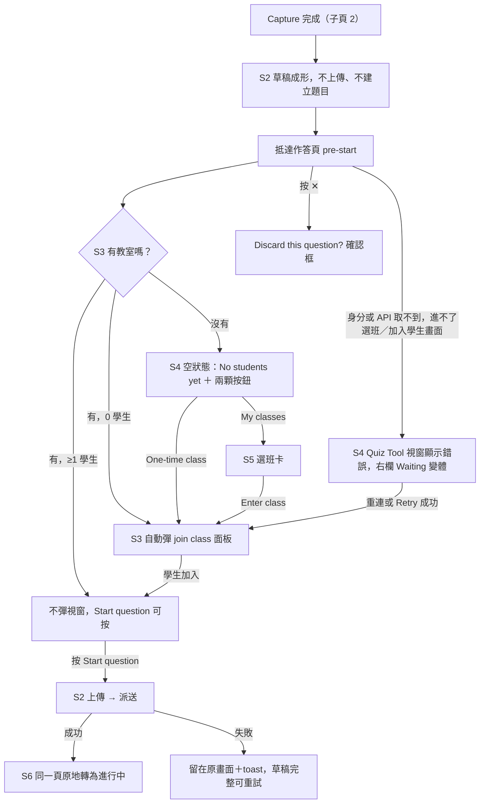

<!--
==============================================================
SOURCE TRACKING — 更新來源後請同步更新此區塊與內文
==============================================================

page_id:        606765141
url:            https://viewsonic-vsi.atlassian.net/wiki/spaces/_/pages/606765141
title:          3. 出題與派送（Scope 1 邏輯 / Scope 2 換皮）
space_id:       286228785
cloned_version: 17
cloned_at:      2026-09-03

Maintenance rule: 重新 clone 前先看 git diff，若本機有補充註解要先 commit；
                  版號與 cloned_at 一起更新，commit 訊息附來源 URL。
                  取得方式：python3 scripts/clone-atlassian.py …（見該檔 docstring）
==============================================================
-->

> | 來源頁面 | page_id | clone 版本 | clone 日期 |
> |---|---|---|---|
> | [3. 出題與派送（Scope 1 邏輯 / Scope 2 換皮）](https://viewsonic-vsi.atlassian.net/wiki/spaces/_/pages/606765141) | 606765141 | v17 | 2026-09-03 |

# 3. 出題與派送（Scope 1 邏輯 / Scope 2 換皮）

> **交付範圍：本頁跨兩期。**
> 
> - **Scope 1（邏輯）**：維持**現行** Setting 頁的介面，只加兩條規則 —— 沒有班級也能抵達這頁（`S1-5`）、沒有學生加入前 Start 不能點（`S1-6`）。
> - **Scope 2（換皮）**：**Setting 頁不存在了**。設定移進截圖遮罩（子頁 2），而**作答頁的範圍往前延伸**，多出一個派題前的 pre-start 狀態（子頁 4）。
> 
> 修正原因見[總覽頁](https://viewsonic-vsi.atlassian.net/wiki/spaces/myViewboar/pages/606797917)。
> 
> 🆕 **2026-08-28 新增**：**pre-start 取得教室失敗的處理**（Story 4，`S2-30` 系列，已依設計稿定義兩種錯誤狀態）。

> 📐 **本頁已依 PRD normalizer 重排**：拆成 **6 個 story**，最前面一張總覽流程圖，每個 story 底下是自己的 **Given／When／Then**（三欄）與狀態覆蓋。邊界與異常情境**升格為 AC 列**，拆不成列的才在表下備註。

## 動線總覽（Scope 2 交付後）

Diagram

---

# Story 1 · Scope 1：無班級也能出題、沒學生不能派題

> **身為**還沒選班的老師，
> **我希望**可以先把題目做到只差按下 Start，
> **這樣**我不用在還不確定要出什麼題之前，就先做一個有成本的決定。

### 驗收條件

| # | Given | When | Then | **QA test result** |
|---|---|---|---|---|
| **S1-5** | 已登入、**尚未選班** | 走現行動線出題（Questions → 題型 → 截圖 → Capture） | 抵達 Setting 頁：截圖顯示於預覽、設定可改、草稿保留；**不因為沒有教室而被擋下或報錯** | Pass  MVBW version: v3.4.14.971-s |
| **S1-6** | 在 Setting 頁 | 現場學生數為 **0** | Start question **反灰不可按**；有 1 位以上學生時可按 | Pass |
| **S1-6a**（Scope 1 例外） | 在 Setting 頁、**完全沒有教室** | 現場學生數為 0 | Start question **仍可按** —— 它是現行 Setting 頁上叫出選班卡的**唯一入口**，反灰會造成死鎖。**Scope 2 取消這個例外**（見 Story 3 `S2-4`） |  |
| **S1-8** | 已 Capture、草稿在 Setting 頁 | 按 Start question | **此時才**依序執行圖片上傳與題目送出；按鈕在期間顯示 loading 且不可重複點。Capture 到 Start 之間**不進行任何上傳** |  |

**備註 · 為什麼無班級也要能抵達**：題目內容與教室無關。把選班擋在出題前面，等於要求老師在還不確定要出什麼題之前先做一個有成本的決定。

**狀態覆蓋 5/6**　`Happy path` `Error 上傳失敗可重試` `Loading 按鈕內` `Empty 無班級可達` `Boundary 0 學生反灰` `Interruption 見 Story 2`

---

# Story 2 · Start question 是唯一的觸發點

> **身為**老師，
> **我希望**還沒決定要送出的題目不會先花掉我的網路與時間，
> **這樣**我改框、換題型、直接丟掉，都不會留下任何殘留。

| 時機 | 發生什麼 | 不發生什麼 |
|---|---|---|
| Capture 完成 | 題目草稿成形（截圖、題型、答題設定），畫面前進到 pre-start | **不上傳圖片、不建立題目** |
| 老師按 Start question | **這一刻才**判斷並執行：圖片上傳 → 題目送出 | — |

### 驗收條件

| # | Given | When | Then |
|---|---|---|---|
| **7** | 已框選、選型並設定完成 | 點 Capture | 進入**作答頁 pre-start**：版面與進行中完全相同，主要按鈕為 **Start question**；**不再有 Setting 頁**，且**不進行上傳** |
| **S2-1** | pre-start，**已有學生** | 按 Start question | 主要按鈕轉 loading（**期間不可重複點**）→ 上傳 → 派送 → 同一頁轉為 open：計時器開跑、按鈕變 Stop submissions、名冊開始填入 |
| **13** | pre-start（未派題） | 按 **✕** | 出現 **「Discard this question?」確認框**；確認後關閉面板回到工具列，取消則留在 pre-start、草稿完整 |
| **S2-21**（新增） | Start question **已按下、上傳／派送進行中** | 老師按 ✕ | ✕ **暫時不可用**（與主要按鈕同步 disabled），直到成功或失敗有結果為止 |
| **S2-22**（新增） | pre-start 有未送出的草稿 | 老師**關掉 toggle**或 App 被關閉 | 草稿**不保留**，下次打開回到乾淨狀態 |

**備註 · 為什麼收成一個觸發點**：①**行為統一**；②**消除死鎖**（舊模型下教室若以非 Start 的路徑到達，沒有人補跑被延後的上傳，Start 會永久反灰 —— POC r60 實際踩到）；③**不為未送出的題目付代價**。

**狀態覆蓋 6/6**　`Happy path` `Error 失敗留原畫面＋toast` `Loading 按鈕內` `Empty 草稿階段無伺服器狀態` `Boundary 重複點擊防護` `Interruption 上傳中按 ✕、關掉 toggle`

---

# Story 3 · pre-start 進場：要不要自動出現視窗

> **身為**剛做完題目的老師，
> **我希望**系統只在我還缺一件明確的東西時才主動幫我，
> **這樣**它不會替我做我還沒決定的事。

### 驗收條件

| # | Given | When | Then |
|---|---|---|---|
| **S2-10** | **已有教室且現場有 1 位以上學生** | 抵達 pre-start | **不出現任何浮動視窗**；學生區顯示名冊；Start question 可按 |
| **S2-11** | **已有教室但現場 0 學生** | 抵達 pre-start | **join class 面板自動出現**於右側；學生區顯示「**Waiting for students to join…**／Share the class link so your students can join.」；Start question 反灰 |
| **S2-12** | **完全沒有教室** | 抵達 pre-start | **不出現任何浮動視窗**；學生區顯示「**No students yet**／Start a one-time class, or pick one you’ve already made.」＋ **One-time class** 與 **My classes** 兩顆按鈕；Start question 反灰 |
| **S2-4** | pre-start | 現場學生數為 0 | Start question **一律反灰**（**不論有無教室**） |
| **S2-23**（新增） | 老師停留在 pre-start 很久，期間**教室在別處被結束**（或學生全部離線） | 學生數歸零 | Start question **轉為反灰**；學生區回到對應的空狀態變體 |

**備註 · 為什麼「沒有教室」不自動彈**：此時老師還有一個系統替他決定不了的選擇 —— 一次性班級 vs 既有班級。自動彈出任一個都是替他做決定。反過來「已有教室但 0 人」時只剩一件事要做，自動彈是**省一步**。

**狀態覆蓋 5/6**　`Happy path` `Error 見 Story 4` `Loading 見 Story 5` `Empty 兩種空狀態變體` `Boundary 0 學生一律反灰` `Interruption 停留期間學生數改變`

---

# Story 4 · 取得教室：兩顆按鈕、選班卡，以及連畫面都進不去時

> **身為**連班都還沒有的老師，
> **我希望**畫面上直接告訴我可以怎麼取得一個班、連不上時也知道是網路還是系統的問題，
> **這樣**我不會卡在一個「Start 反灰但不知道為什麼」的畫面前。

### 選班卡的兩種狀態（`my classes == 0?`）

| 狀態 | 清單區 | 主要行動 | 底部 |
|---|---|---|---|
| **一個班級都沒有** | Google Classroom icon ＋「Open myViewBoard Hub in your browser to import your Google Classroom roster.」 | **Open myViewBoard Hub**。**沒有 Enter class** | 分隔線「Or」＋ **One-time class · Start now** |
| **有班級** | 班級清單（班名＋人數，預設選中第一個） | **Enter class** | 同上 |

### 取不到教室時的兩種錯誤狀態（2026-08-28 依設計稿定義）

> **這裡講的「失敗」是什麼**：**token 交換失敗**或 **API 打失敗** —— 概念上是**老師連選班級的畫面都進不去**，或訪客**連加入學生的畫面都出不來**。
> ⚠️ 這**不是** `9b-1` 的「已經在選班卡上、選了班按 Enter class 才失敗」—— 那一種老師已經看得到清單，錯誤回到清單上即可。兩者是不同階段的失敗，處理方式因此不同。

兩種狀態都顯示在**標題為 Quiz Tool 的視窗**（與選班卡同一個視窗殼、同樣置右、無遮罩），右上有 **✕**：

| 情況 | 圖示 | 文案 | 行動 |
|---|---|---|---|
| **沒有網路** | 斷線圖示 | **No internet. Reconnecting…** | **無按鈕** —— 系統自動重連 |
| **API 失敗** | 錯誤圖示 | **Something went wrong. Please try again.** （**Error 1001** —— 帶錯誤碼） | **Retry**（實心主按鈕） |

### 驗收條件

| # | Given | When | Then |
|---|---|---|---|
| **S2-13** | pre-start 空狀態（沒有教室） | 按 **One-time class** | 起一次性班級，**join class 面板出現**（班級碼／QR）；學生區轉為「Waiting for students to join…」 |
| **S2-14** | pre-start 空狀態（沒有教室） | 按 **My classes** | **選班卡出現**，內容依老師有沒有班級分兩種（見上表） |
| **S2-15** | 選班卡顯示班級清單 | 選定班級並按 **Enter class** | 進班完成後選班卡**換成 join class 面板**；學生區「Waiting for students to join…」；**不自動派題** |
| **S2-30**（新增） | 在 pre-start 畫面中，系統嘗試取得教室所需的身分或資料 | **沒有網路**，導致老師**進不到選班級畫面**（訪客則是進不到加入學生畫面） | **Quiz Tool 視窗**出現於右側，顯示斷線圖示＋「**No internet. Reconnecting…**」，**不放任何按鈕**（自動重連）。學生區顯示「**Waiting for students to join…**」變體。toggle、三顆按鈕與題目草稿**都不受影響** |
| **S2-30a**（新增） | 同上情境 | **token 交換或 API 失敗**（非網路問題） | **Quiz Tool 視窗**出現於右側，顯示錯誤圖示＋「**Something went wrong. Please try again.**」＋**錯誤碼**（例：Error 1001）＋ **Retry** 按鈕。學生區同樣顯示「Waiting for students to join…」變體 |
| **S2-30b**（新增） | Quiz Tool 視窗顯示著錯誤狀態 | 自動重連成功，或老師按 **Retry** 成功 | 錯誤狀態消失，視窗**原地**轉為應有的內容（選班卡或 join class 畫面）；**位置不移動** |
| **S2-30c**（新增 · 反向） | Quiz Tool 視窗顯示著錯誤狀態 | 老師按 **✕** 關掉視窗 | 回到 pre-start；學生區維持空狀態、草稿完整；老師可從三顆按鈕**再試一次** |
| **S2-16** | join class 面板顯示中、學生區為空狀態 | 第 1 位學生加入 | **join class 面板不自動關閉**、位置不動；學生區由空狀態轉為名冊；Start question 轉為可按 |
| **S2-24**（新增） | 選班卡顯示「一個班級都沒有」 | 老師按 **Open myViewBoard Hub**，到瀏覽器匯入名冊後回到 App | 選班卡的班級清單**重新整理**，匯入的班級出現在清單上 |

**備註 · 為什麼右欄是「Waiting」而不是「No students yet ＋兩顆按鈕」**：此時老師連選班畫面都進不去，放上 One-time class／My classes 兩顆按鈕等於給他兩個一按也會失敗的出口。改用中性的等待文案，把「發生什麼事、能做什麼」集中在 Quiz Tool 視窗裡。

**備註 · 為什麼斷網沒有 Retry**：斷網是**會自己恢復**的狀態，系統持續重連即可；給一顆按鈕反而要求老師去做一件他做不到的事。API 失敗則不會自己好，所以要 Retry ＋錯誤碼（讓客服能對得上）。

**備註 · 錯誤碼的呈現**：設計稿以 `Error 1001` 示意，實際碼值與對照表由 RD 與後端定義；本頁只規範**要顯示一個可回報的錯誤碼**。

**狀態覆蓋 6/6**　`Happy path` `Error 斷網／API 兩種` `Loading 按鈕內 spinner` `Empty 沒有班級的匯入引導` `Boundary 一次性班級為備援出口` `Interruption 關掉錯誤視窗後可再試`

---

# Story 5 · 選班卡：所有入口共用同一張卡

> **身為**老師，
> **我希望**不管我從哪裡叫出選班，看到的都是同一張卡，
> **這樣**同一個決定不會有兩種畫面語言。

### 驗收條件

| # | Given | When | Then |
|---|---|---|---|
| **9** | 選班卡顯示中 | 按 Enter class（或 one-time Start now） | 該按鈕轉 **spinner**、卡片內容與尺寸不變且暫不可互動；進班完成後**換成 join class 面板**；**不自動派題** |
| **9a** | 已登入未進班 | 由 **Join Class 按鈕**叫出選班畫面 | 其呈現與 pre-start 的 My classes 路徑**完全相同**：無遮罩、貼右浮動卡、同卡片外框與層級 |
| **9b** | Join Class 按鈕路徑的選班卡 | 按 Enter class（或 Start now） | 該按鈕轉 spinner、卡片**留在畫面上直到進班完成**，Join Class QR 面板於同一刻出現接手（**無 3 秒空白**） |
| **9b-1**（失敗路徑） | 老師**已經看得到班級清單**、選了班並按 Enter class | 該次進班**失敗** | 回到**班級清單**＋紅色錯誤，卡片不關閉 —— 老師可以換一個班或再試一次 |
| **9c**（反向） | Join Class 按鈕路徑的選班卡 | 未選班**直接關閉**（✕／Esc） | 卡片單純關閉、ClassSwift toggle 維持 ON、**無任何待派題被取消或觸發** |
| **12** | pre-start 的 **My classes** 路徑叫出的選班卡 | 直接關閉不選班 | 回到**作答頁 pre-start 空狀態**、草稿與截圖保留，**兩顆按鈕仍在** |

**備註 · **`9b-1`** 與 **`S2-30`** 是不同階段的失敗**：`9b-1` 是「**清單拿得到、進某一個班失敗**」，錯誤留在清單上最有用（老師可以換一個班）；`S2-30` 是「**連清單／加入畫面都拿不到**」，這時沒有清單可以回，所以由 Quiz Tool 視窗承載整體錯誤。

**備註 · 關閉語意依入口而異**：`9c` 是單純關閉；`12` 回到空狀態（因為那裡還有一份等著被派出的草稿）。

**備註 · 三個浮動視窗統一置右、無遮罩**：選班卡、Activating 視窗、Join Class 視窗預設位置一律在右側且都不使用遮罩（子頁 1 `S1-33`）。

**狀態覆蓋 6/6**　`Happy path` `Error 進班失敗回清單` `Loading 按鈕內 spinner` `Empty 沒有班級的匯入引導` `Boundary 進班中不可互動` `Interruption 未選班直接關閉`

---

# Story 6 · Start 之後：同一頁原地轉真

> **身為**老師，
> **我希望**按下 Start 之後看到的是「開始了」而不是「換了一頁」，
> **這樣**我不用重新找我剛剛在看的東西在哪裡。

### 驗收條件

| # | Given | When | Then |
|---|---|---|---|
| **10** | 作答頁 pre-start | 派題完成 | 同一面板**原地**轉為真實進行中：計時器開跑、位置零移動、**不重新掛載**、版面零變化 |
| **14** | Sketch 的設定畫面 | 點 add more question | **暫時不做**（見子頁 2 決策 #11）—— 該入口不實作 |
| **8**（Scope 2 不再需要） | — | — | 原稿的「Start 後立即切換為預覽作答頁」在 Scope 2 失去意義：作答頁**本來就在** |

**備註 · finish 階段仍未決（**`Q4`**）**：pre-start 與進行中既然統一為同一個版面，finish 要不要也維持同一個版面，需要一個決定。

**狀態覆蓋 4/6**　`Happy path` `Error 派送失敗見 Story 2` `Loading 見 Story 2` `Empty 不適用` `Boundary 不適用` `Interruption finish 階段未決`

---

## 動線變化對照

|  | Scope 1 | Scope 2 |
|---|---|---|
| 動線 | Questions → 題型選單 → 截圖 → **Setting** → Start | Questions → **截圖（含設定）** → **作答頁 pre-start** → Start |
| Setting 頁 | 存在 | **不存在** |
| 作答頁 | 派題後才出現 | **派題前就在** |
| 沒有教室時 | Start 可按（唯一的選班入口） | **Start 純粹依學生數反灰** |

## Setting 頁的處置

| 原稿項目 | Scope 2 的歸屬 |
|---|---|
| 題型唯讀 chip | 題型在遮罩上選定；pre-start 以摘要 chip 陳述 |
| 答題模式 Segmented | **移到截圖遮罩**，見子頁 2 |
| 選項數量 Segmented〔2…6〕 | **移到截圖遮罩** |
| 選項標示 Segmented〔ABC｜123〕 | **已移除**。需裁決（**Q6**） |
| 截圖顯示＋「Uploads when class starts」註記 | pre-start **照常顯示題目縮圖**（決策 #27 **反轉**）。上傳註記**取消** |

## Figma node 對照

File `4C21d9puOZJcUyUR26oibd`。⚠️ 改版前重新確認 node-id。

| node-id | 是什麼 |
|---|---|
| `22288:89959` | 決策：**In lesson?** |
| `22288:89962` | 決策：**>=1 student joined?** |
| `22427:186726` | 決策：**my classes == 0?** |
| `22291:90511` | 畫面：有教室＋有學生 —— 無浮動視窗 |
| `22291:90938` | 畫面：有教室＋0 學生 —— **join class 自動出現** |
| `22278:85926` | 畫面：沒有教室 —— 空狀態＋**兩顆按鈕** |
| `22427:186734` | 畫面：選班卡 · **一個班級都沒有** |
| `22291:91958` | 畫面：選班卡 · **有班級清單** |
| `22291:93206` | 畫面：按 One-time class 之後 —— join class 面板 |
| `22291:92582` | 畫面：按 Enter class 之後 —— join class 面板 |
| `22291:95161` ／ `22291:103781` | 畫面：學生加入之後 —— **面板仍在** |
| `22490:353846` | 畫面：Start question 之後 |
| *待補* | `S2-30`／`S2-30a` 的兩種錯誤狀態（**設計稿已提供圖檔，尚未取得 node-id**） |

---

## 新增待裁決（normalizer 補的列）

| AC | 問題 | 建議預設值 |
|---|---|---|
| `S2-21` | 上傳／派送進行中，老師按 ✕ 會怎樣？ | ✕ **暫時不可用**，直到有結果 |
| `S2-22` | 有未送出草稿時關掉 toggle 或 App，草稿保留嗎？ | **不保留** |
| `S2-23` | 停留在 pre-start 期間學生數變成 0 怎麼辦？ | Start **轉為反灰**，判定持續生效 |
| `S2-24` | 從 myViewBoard Hub 匯入名冊回來後，選班卡要刷新嗎？ | **要** |
| `S2-30b`／`S2-30c` | 錯誤視窗重連成功／被關掉之後怎樣？ | 成功 → **原地轉正常內容、位置不動**；關掉 → 回 pre-start，可再試 |

## 未決

| # | 待決問題 | 為什麼非決不可 |
|---|---|---|
| **Q4** | **finish 階段（按下 Stop submissions 之後）畫面顯示什麼** | pre-start 與進行中已統一為同一個版面，finish 要不要也一致，需要一個決定 |
| **Q6** | **選項標示〔ABC｜123〕移除是刻意還是遺漏** | 原稿列為三組 segmented 之一，POC 只實作兩組 |
| **Q16**（新增） | **錯誤碼的對照表**：`Error 1001` 之外還有哪些？誰維護？客服拿到碼要怎麼查？ | `S2-30a` 要求顯示可回報的錯誤碼，但碼值與對照表尚未定義，否則顯示了也沒人查得到 |

> **〔已關閉〕Q15**（進班失敗看到哪個視窗）→ **不衝突**：`9b-1` 是「清單拿得到、進某一班失敗」，`S2-30` 是「連清單／加入畫面都拿不到」，兩者是不同階段的失敗。
> **〔已關閉〕Q5**（Sketch add more question）→ 暫時不做。**子頁 4 Q1／Q2／Q3** 皆已結案。⚠️ **子頁 4 的 AC 11 在 Scope 2 作廢**。

## 決策記錄

| # | 問題 | 決定 | 為什麼 |
|---|---|---|---|
| 7 | 選班時機 | **Start question 時** | 題目內容與教室無關，等待應該最小化 |
| 9 | 選班等待表達 | **按鈕內 spinner、卡片不變形** | 等待狀態內嵌在觸發它的按鈕上，是最不打擾的表達 |
| 15 | MC 單複選 | **解鎖** | 舊限制是 slice 延後造成的 |
| 18 | 選班畫面呈現 | **統一為無遮罩、置右浮動卡** | 同一個決定不該有兩種畫面語言 |
| 19（**作廢**） | Sketch add more question | **暫時不做** | POC r41 已移除入口 |
| **23** | Setting 頁在新動線裡還存在嗎 | **移除，作答頁前延** | Capture 之後只剩一個決定，為此保留一整頁介面等於多一關 |
| **24**（修正） | 0 學生時可否派題 | **Start 一律 disable**；Scope 2 取消「無教室放行」例外 | 派給空教室的題目沒有意義 |
| **25** | pre-start 按 ✕ 的語意 | **丟棄確認框** | 草稿是老師剛完成的工作 |
| **29**（修正） | 圖片上傳與題目送出何時做 | **一律等 Start question** | 行為統一、消除死鎖、不為未送出的題目付代價 |
| **30** | pre-start 進場時要不要自動彈視窗 | **只有「已有教室且現場 0 學生」自動彈** | 沒有教室時老師還有一個系統替他決定不了的選擇 |
| **31** | 選班卡在「一個班都沒有」時顯示什麼 | **匯入引導**＋ Open myViewBoard Hub | 沒有班級時 Enter class 沒有東西可以進 |
| **32**（新增 2026-08-28） | 取不到教室時錯誤放哪裡、長什麼樣 | **由 Quiz Tool 視窗承載**（置右、無遮罩、同一個視窗殼）。**斷網＝自動重連、無按鈕**；**API 失敗＝錯誤碼＋Retry**。學生區顯示中性的 Waiting 變體 | 斷網會自己恢復，給按鈕等於要求老師做一件他做不到的事；API 失敗不會自己好，所以要 Retry 與可回報的錯誤碼。學生區不放兩顆按鈕，是因為此時它們一按也會失敗 |
