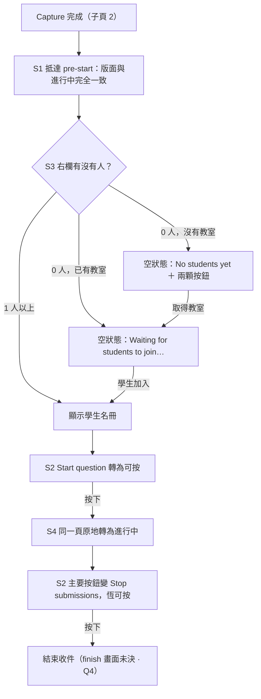

<!--
==============================================================
SOURCE TRACKING — 更新來源後請同步更新此區塊與內文
==============================================================

page_id:        606568769
url:            https://viewsonic-vsi.atlassian.net/wiki/spaces/_/pages/606568769
title:          4. 作答頁（含 pre-start）與空狀態
space_id:       286228785
cloned_version: 10
cloned_at:      2026-09-03

Maintenance rule: 重新 clone 前先看 git diff，若本機有補充註解要先 commit；
                  版號與 cloned_at 一起更新，commit 訊息附來源 URL。
                  取得方式：python3 scripts/clone-atlassian.py …（見該檔 docstring）
==============================================================
-->

> | 來源頁面 | page_id | clone 版本 | clone 日期 |
> |---|---|---|---|
> | [4. 作答頁（含 pre-start）與空狀態](https://viewsonic-vsi.atlassian.net/wiki/spaces/_/pages/606568769) | 606568769 | v10 | 2026-09-03 |

# 4. 作答頁（含 pre-start）與空狀態

> **交付範圍：本頁跨兩期。**
> 
> - **Scope 1**：本頁的邏輯（AC 15／16）維持現行行為，**唯 AC 15 於 2026-08-27 簡化**（Stop submissions 改為恆可按）。
> - **Scope 2**：本頁是「作答頁往前延伸」的載體 —— 作答頁多出一個派題前的 **pre-start 狀態**，Setting 頁隨之移除（見子頁 3）。
> 
> 原稿把作答頁當成「要改版的畫面」；修正後它是**被延伸的畫面**：版面不變，只是提早出現。

📐 **本頁已依 PRD normalizer 重排**：拆成 **4 個 story**，最前面一張總覽流程圖，每個 story 底下是自己的 **Given／When／Then**（三欄）與狀態覆蓋。邊界與異常情境**升格為 AC 列**；真的拆不成列的才在表格下方備註。新增的列標成 `新增` 並附建議預設值。

## 一句話

**pre-start 就是進行中的畫面，只是還沒開始。** 版面、欄位、元件全部相同，**只有三個地方不一樣** —— ①主要按鈕是 **Start question** 而不是 Stop submissions；②計時器停在 **00:00** 沒有走；③右欄在 0 人時顯示**空狀態**而不是名冊。除此之外沒有任何 UI 差異，**也不需要為 pre-start 另做元件**。

## 動線總覽

Diagram

---

# Story 1 · 版面：pre-start 與進行中完全一致

> **身為**老師，
> **我希望**按下 Start 之後看到的是「開始了」而不是「換了一頁」，
> **這樣**我不用重新找我剛剛在看的東西在哪裡。

### 逐項對照

整張表只有**最後三列**有差異，其餘全部相同 —— 這是「同一個畫面換狀態」而不是「兩個畫面」的具體意思。

| 元素 | pre-start | 派題後（進行中） |
|---|---|---|
| 題型摘要 chip（題型＋答題模式） | 顯示 | 相同 |
| **題目縮圖** | **顯示** | 相同 |
| **Options 選項卡** | **顯示** | 相同 |
| 右欄 Responses 標頭、Refresh、計數 | 顯示，計數為 **0 / 0** | 相同，計數隨作答更新 |
| **計時器** | 顯示，**00:00 未起跑** | 相同位置，**開始計時** |
| **右欄內容** | 0 人時**空狀態**；有人時名冊 | 學生名冊 |
| **主要按鈕** | **Start question** | **Stop submissions** |

### 驗收條件

| # | Given | When | Then |
|---|---|---|---|
| **S2-19** | pre-start | 與派題後的畫面逐項比對 | 兩者**只有三處不同**：主要按鈕（文案與可用性）、計時器是否走動、右欄是空狀態或名冊。**不得為 pre-start 另做版面或隱藏任何既有元件** |
| **S2-25**（新增） | pre-start 顯示中 | 視窗大小或顯示模式改變（whiteboard ⇄ desktop） | 版面依既有的響應規則調整，**pre-start 與進行中套用同一套規則**，不另做斷點 |

**備註**：這推翻了先前 POC 的做法（大碼錶取代題目縮圖、移除 Options 與 header 計時器）—— 該做法**已作廢**（決策 #27 反轉）。若 RD 手上還是舊版本，這是最容易做反方向的一條。

**狀態覆蓋 4/6**　`Happy path` `Error 見 Story 4` `Loading 見 Story 2` `Empty 見 Story 3` `Boundary 視窗／模式改變` `Interruption 見 Story 4`

---

# Story 2 · 主要按鈕：兩種語意，只有一邊有條件

> **身為**老師，
> **我希望**要結束一題的時候永遠按得下去，
> **這樣**我不會被鎖在一個我想離開的狀態裡。

| 狀態 | 按鈕 | 可用性 |
|---|---|---|
| **pre-start** | **Start question** | **沒有學生加入前反灰**（子頁 3 `S1-6`／`S2-4`）—— 派一題給沒有人的教室，結果頁必然是空的 |
| **進行中** | **Stop submissions** | **恆可按**，不看學生數、不看是否曾有學生、不看有沒有作答資料 |

### 驗收條件

| # | Given | When | Then |
|---|---|---|---|
| **15**（2026-08-27 簡化） | 題目**進行中** | 任何時刻（學生全數離線、從未有學生加入、人數與名冊不符，皆包含在內） | **Stop submissions 恆可按**，按下即結束收件。**不再依學生數或「是否曾有學生」判定**。〔原文：「曾有學生」才可按，從未有學生則 disabled〕 |
| **S2-20** | 題目進行中，**從未有任何學生加入** | 按 Stop submissions | **可按且正常結束**收件，進入結束流程；**不得因為沒有作答資料而反灰或報錯** |
| **S2-27**（新增） | 進行中，已按下 Stop submissions | 結束收件的請求進行中 | 按鈕內 loading、**期間不可重複點**；失敗則留在進行中畫面並可重試，**不得把題目留在半結束的狀態** |

> **〔已移除〕**`S2-26`（Start question 反灰時，hover／長按顯示「需要至少一位學生加入才能派題」的原因提示）—— **2026-09-01 移除，不實作**。編號**不重用**。

**備註 · 為什麼兩邊不對稱**：Start 是「送出」，設條件是因為它會產生一份沒有人作答的結果；Stop 是「結束」，擋住它只會把老師鎖在他想離開的狀態裡。先前兩版（`cells.isEmpty`、「曾有學生」）都在找「什麼條件下該擋」，但 `cells.isEmpty` 因帳號教室會為整個名冊建格子而失效，「曾有學生」則留下「學生一個都沒進來時無法收掉題目」的死角。**直接取消條件比繼續調整判定式更正確**。

**狀態覆蓋 5/6**　`Happy path` `Error 結束失敗可重試` `Loading 按鈕內` `Empty 從未有學生也能結束` `Boundary 重複點擊防護` `Interruption finish 畫面未決（Q4）`

---

# Story 3 · 右欄空狀態：兩種變體

> **身為**還在等學生的老師，
> **我希望**畫面告訴我現在缺的是「班」還是「人」，
> **這樣**我知道下一步該做什麼。

同樣是「右欄 0 人」，但老師的處境不同，所以文案與行動不同：

| 變體 | 老師的處境 | 標題 | 說明 | 按鈕 |
|---|---|---|---|---|
| **還沒有教室** | 連班都還沒有，得先取得一個 | **No students yet** | Start a one-time class, or pick one you’ve already made. | **One-time class** ／ **My classes** 兩顆 |
| **已有教室、還沒有人加入** | 班已經開好了，只差把學生找進來 | **Waiting for students to join…** | Share the class link so your students can join. | **無** —— 此時 join class 面板已自動出現在右側，行動在那裡 |

### 驗收條件

| # | Given | When | Then |
|---|---|---|---|
| **S2-17** | pre-start、**還沒有教室** | 右欄 0 人 | 空狀態顯示 **No students yet** ／ Start a one-time class, or pick one you’ve already made. ＋ **One-time class**／**My classes** 兩顆按鈕；**不顯示骨架卡**。左欄照常顯示題目縮圖與 Options |
| **S2-18** | pre-start、**已有教室但無人加入** | 右欄 0 人 | 空狀態顯示 **Waiting for students to join…** ／ Share the class link so your students can join.，**不放按鈕**（行動在同時自動出現的 join class 面板上）；**不顯示骨架卡** |
| **S2-28**（新增） | pre-start，空狀態顯示「No students yet」 | 老師取得教室（One-time class 或 Enter class 完成） | 空狀態**就地換成**「Waiting for students to join…」變體，兩顆按鈕收起；**不重新掛載右欄** |
| **16** | 帳號教室含全班名冊 | 派題後無人實際在線 | **作答中**的空狀態正常顯示，以**現場人數**判定而非格子數；**結果頁不顯示空狀態** |

**備註 · 文案刻意與 Figma 分歧**：設計稿寫的是 `No student yet`（單數），本 spec 定為 `No students yet`**（複數）**。英文語感上複數才自然，且這句會進 41 個語系。實作與翻譯一律以本頁為準，**需回頭請設計改稿**。

**備註 · 進行中的空狀態尚未對齊**：pre-start 已改為 icon＋文案（**不使用骨架卡**），但「進行中」仍是匿名骨架卡 —— **Figma 未涵蓋該狀態**，兩者的視覺語言目前不一致，需請設計補稿。

**狀態覆蓋 5/6**　`Happy path` `Error 見 Story 4` `Loading 見子頁 3` `Empty 兩種變體` `Boundary 以現場人數判定` `Interruption 取得教室後就地換文案`

---

# Story 4 · Start 之後：同一頁原地轉真

> **身為**老師，
> **我希望**派題失敗的時候我剛做好的題目還在，
> **這樣**我可以再按一次，而不是重做一遍。

### 驗收條件

| # | Given | When | Then |
|---|---|---|---|
| **S2-2** | pre-start 狀態 | 按 Start question（條件符合） | 同一面板原地轉為進行中：**畫面上唯一改變的是主要按鈕、計時器開跑、右欄由空狀態轉為名冊**；題型摘要、題目縮圖、Options 選項卡、欄位配置、面板位置**完全不變**，且**不重新掛載** |
| **S2-29**（新增） | pre-start，已按 Start question | 上傳或派送**失敗** | **留在 pre-start**＋toast；草稿、截圖、題型設定**完整保留**，主要按鈕恢復可按，老師可直接再按一次 |
| **11**（**作廢**） | — | — | 原文為「派題成功且現場 0 學生 → Join Class 自動顯示」。**此情境不存在** —— 派題的前提是現場已有學生（`S1-6`／子頁 3 決策 #24），所以「派題成功且 0 學生」不可能發生。Join Class 的自動出現時機改由子頁 3 `S2-11`（pre-start、已有教室、0 學生）定義 |

**備註 · finish 階段仍未決（Q4）**：按下 Stop submissions 之後計時器已停。pre-start 與進行中既然統一為同一個版面，finish 要不要也維持同一個版面、計時器停在最終時間，需要一個決定。這是本頁唯一還會影響版面的未決事項。

**狀態覆蓋 5/6**　`Happy path` `Error 派送失敗留原畫面` `Loading 按鈕內` `Empty 不適用` `Boundary 不重新掛載` `Interruption finish 未決`

---

## 新增待裁決（normalizer 補的列）

| AC | 問題 | 建議預設值 |
|---|---|---|
| `S2-25` | 視窗大小／顯示模式改變時，pre-start 的響應規則？ | 與進行中**同一套**，不另做斷點 |
| `S2-27` | Stop submissions 按下之後、結束請求進行中的狀態？ | 按鈕內 loading、不可重複點；失敗可重試，**不留半結束狀態** |
| `S2-28` | 取得教室之後，空狀態怎麼從第一種變成第二種？ | **就地換文案**、兩顆按鈕收起，不重新掛載右欄 |
| `S2-29` | 派題失敗之後草稿還在嗎？ | **完整保留**，留在 pre-start，按鈕恢復可按 |

## 已移除的 AC

> `S2-26`（Start question 反灰時 hover／長按顯示原因提示）—— **2026-09-01 PM 決定移除，不實作**。編號不重用。

## 未決

| # | 待決問題 | 為什麼非決不可 |
|---|---|---|
| **Q4** | **finish 階段（按下 Stop submissions 之後）畫面顯示什麼** | pre-start 與進行中已統一為同一個版面，finish 要不要也維持同一個版面、計時器停在最終時間，需要一個決定（本頁與子頁 3 共用此題） |

> **〔已關閉〕Q1**（空狀態在哪些狀態出現、要不要按鈕）→ **pre-start 放按鈕**：沒有教室時放兩顆，已有教室時不放（`S2-17`／`S2-18`）；進行中維持無按鈕；結果頁不顯示。
> **〔已關閉〕Q2**（Join Class 自動出現的時機）→ **pre-start、已有教室、現場 0 學生**時自動出現（子頁 3 `S2-11`）。
> **〔已關閉〕Q3**（Start／Stop 共用按鈕的 disabled 語意）→ **只有 pre-start 那一邊有條件**；Stop submissions 恆可按。

## 決策記錄

| # | 問題 | 決定 | 為什麼 |
|---|---|---|---|
| **10**（修訂） | Join Class 時機／位置 | **pre-start、已有教室、現場 0 學生時自動出現**；原生右側預設位置；無光圈。原本的「派題成功且 0 學生」**已作廢** | 有學生在班時再跳視窗只是打擾。原本綁在「派題成功」上，但「沒有學生就不能派題」定案後那個時刻不存在了 —— 真正需要 Join Class 的是「班開好了、還沒有人進來」 |
| **11**（修訂） | 作答頁空狀態 | **pre-start 依 Figma：icon ＋ 標題 ＋ 說明，沒有骨架卡**，並依「有沒有教室」分兩種變體。**進行中**維持 inline、無按鈕、匿名骨架卡 | 骨架卡的用意是預告「學生會長這樣出現在這」，在已經有班、正在等人進來時成立；但在 pre-start 且連班都還沒有時，該解決的是「怎麼取得班級」，鋪一排假學生反而答非所問 |
| **12**（修訂） | Stop submissions 的 enabled 判定 | **恆可按**。不看現場人數、不看是否曾有學生、不看有沒有作答資料 | 這顆按鈕是**結束**不是送出 —— 擋住它只會把老師鎖在他想離開的狀態裡。直接取消條件比繼續調整判定式更正確 |
| 17 | 結果頁空狀態 | **不顯示**（回 POC 前原生渲染） | 空狀態要解的是「等學生進來」，結果頁已經過了那個時刻 |
| **26** | 作答頁在新動線裡的角色 | **往前延伸出 pre-start 狀態** | 另做預覽頁會產生兩個長得像但行為不同的畫面。同一頁多一個狀態，老師按下 Start 看到的是「開始」而不是「換頁」 |
| **27**（**反轉**） | pre-start 要顯示題目縮圖與 Options 選項卡嗎 | **都顯示，版面與進行中完全一致**。原本的「大碼錶取代題目縮圖、移除 Options 與 header 計時器」**作廢** | 那個大碼錶版面是 POC 自己的發明 —— Figma 從頭到尾，pre-start 與進行中用的是**同一個 question section 元件**。原本的理由（重複顯示）成立，但代價更大：它讓 Start 前後變成兩個不同的畫面，正好破壞決策 #26 想達成的「按下去是開始、不是換頁」 |
| **32** | 空狀態標題的英文單複數 | **複數：**`No students yet`。**刻意與 Figma 分歧**，需回頭請設計改稿 | 英文語感上複數才自然（單數會讀成「還缺一位學生」）。這句會進 41 個語系，早定省事 |
