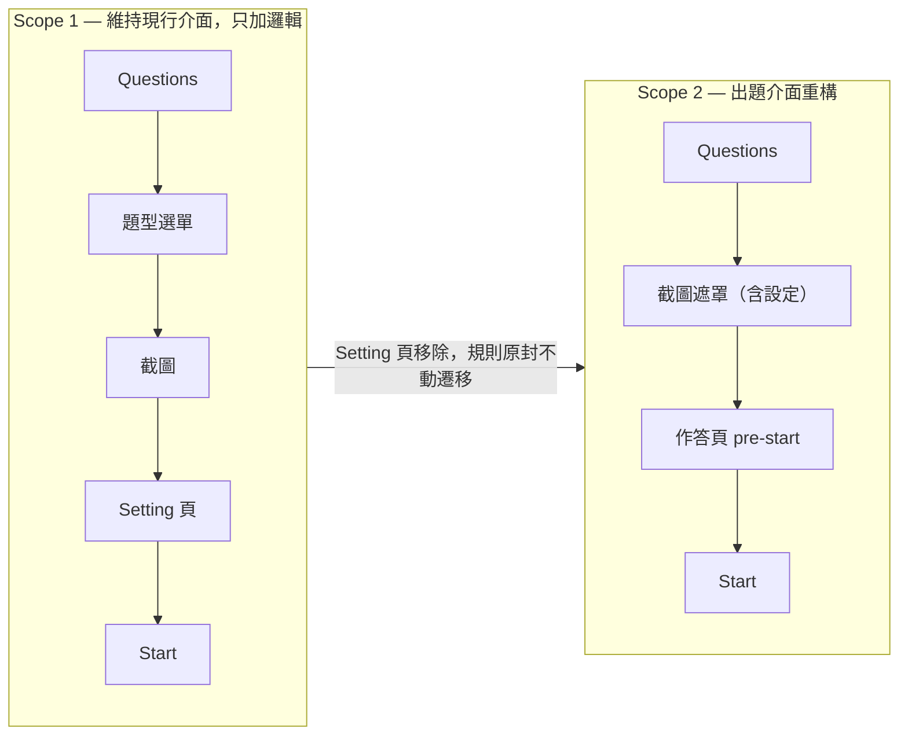

<!--
==============================================================
SOURCE TRACKING — 更新來源後請同步更新此區塊與內文
==============================================================

page_id:        606797917
url:            https://viewsonic-vsi.atlassian.net/wiki/spaces/_/pages/606797917
title:          Quiz Tool 啟動流程改版 — Spec
space_id:       286228785
cloned_version: 27
cloned_at:      2026-09-03

Maintenance rule: 重新 clone 前先看 git diff，若本機有補充註解要先 commit；
                  版號與 cloned_at 一起更新，commit 訊息附來源 URL。
                  取得方式：python3 scripts/clone-atlassian.py …（見該檔 docstring）
==============================================================
-->

> | 來源頁面 | page_id | clone 版本 | clone 日期 |
> |---|---|---|---|
> | [Quiz Tool 啟動流程改版 — Spec](https://viewsonic-vsi.atlassian.net/wiki/spaces/_/pages/606797917) | 606797917 | v27 | 2026-09-03 |

# Quiz Tool 啟動流程改版 — Spec

本頁是 Quiz Tool 啟動流程改版的 spec **總覽**：**我們在解什麼問題、為什麼一路改成現在這樣**。具體行為與驗收條件在四個子頁，每個子頁都已拆成 story，各自帶流程圖與 Given／When／Then。

**來源**：POC prototype branch `poc/quiz-launch-flow`（Viewsonic-EDU/edu-mvb-mac-playground），68 輪 PM eyeball 驗證。設計票：[VSFT-9979](https://viewsonic-vsi.atlassian.net/browse/VSFT-9979)。

**平台範圍**：Windows、Android。Windows 需同時涵蓋 whiteboard mode 與 desktop mode。

---

# 要解的問題

8/12 上線至今，雙平台**啟動 app 的使用者中，走到 Quiz Start 的僅占 1%**。

*(圖片，見原始頁面)*

## 兩個假設

1. **摩擦點在等待**：Windows 上啟動 Quiz Tool 大約要 **5 秒**，這段等待本身就讓老師放棄。→ 對策是**預啟動**：app 冷啟動時就在背景把身分／org（訪客則連同教室）備好，老師打開時不用等。
2. **摩擦點在動線**：老師的意圖是「我要出題目」，但第一眼看到的是「加入班級」，而且出題埋在四關之後。→ 對策是**按鈕驅動＋截圖先**（Scope 2）。

## 成功長什麼樣

Toggle 打開不被打擾；點 Questions 直接框題目；題目就緒才處理班級；學生掃碼進來時題目已經在跑。

## 怎麼驗證

**enter class → 派題的轉換率** —— 分母＝進班的老師數，分子＝成功派出至少一題的老師數。**目標值待上線後取得基線再訂**（`Q10`）。

> **〔已推翻〕原目標：啟動 app 的人中走到 Quiz Start 由 1% → 10%。** 推翻原因：要解的是「**已經進班的老師為什麼沒有出題**」。舊指標可留作副指標，觀察預啟動有沒有副作用。

---

# 修正沿革：為什麼改成現在這樣

這份 spec 從 POC 定案之後經過三輪重大修正。每一條都列出**改了什麼**與**為什麼** —— 沒有理由的規則會在下一次討論被重新推翻一次。

## 2026-08-26 · 目標與預啟動

| 改了什麼 | 為什麼 | 影響 |
|---|---|---|
| **目標從「提高使用率」改為「提高 enter class → 派題的轉換率」** | 舊指標的分母是「啟動 app 的人」，把「還沒進班」與「進班了沒出題」兩種完全不同的流失混在一起。真正要解的是後者 | 實作順序整個重排 —— 離派題越近的工作，對指標的貢獻越直接 |
| **預啟動改在背景進行，不再自動打開 toggle** | 預啟動要解的是「**打開時的等待**」，不是「有沒有被看見」。替老師把工具打開，是替他做了他還沒表達的決定 | 決策 #22 反轉；toggle 的 loading／失敗三態一併取消（#21 作廢） |
| **預啟動依登入狀態分歧**：已登入**不建教室**；未登入**預建訪客教室** | 進哪一班是老師的選擇，不該替他先建一間；但訪客**只有一條路**，沒有選擇成本，先建好就能讓他點 Join Class 時直接看到 QR | 決策 #13／#36 |

## 2026-08-27 · 錯誤處理、等待位置、引導

| 改了什麼 | 為什麼 | 影響 |
|---|---|---|
| **啟動失敗不再跳 toast／snackbar**；錯誤只出現在真正需要那份材料的視窗裡 | 老師剛翻開關就看到「啟動失敗」，合理反應是「壞了，等一下再說」—— 然後他不會去點 Questions。但 Questions 明明可以用。那個 toast 報的是一個**他還沒撞到、甚至可能永遠不會撞到**的失敗，代價卻是勸退一個本來會出題的老師 | 決策 #20；子頁 1 Story 6 |
| **打開 toggle 不再開啟任何視窗、不顯示 loading**；Activating 視窗延後到老師**點 Join Class** 才出現 | 把等待綁在 toggle 上，等於在老師還沒說「我要進教室」之前就先讓他等。而他打開之後最可能做的第一件事是點 Questions，那條路完全不需要材料。**只有 Join Class 真的需要，等待就該放在那裡** | 子頁 1 Story 2／3；原「兩條路」作廢 |
| **onboarding 卡收成單段**，只錨在 Questions；**顯示過一次即停** | toggle 還沒打開時，卡片能講的只有「這個開關是 Quiz Tool」—— 那一刻老師還沒表達任何意圖，對不打算用的人是純粹的打擾。真正卡住轉換的是**打開之後不知道先點哪裡** | 決策 #31；「已成功出題」旗標不再需要，實作簡化為單一 boolean |
| **toggle 只由老師自己關掉**；離開教室、登入／登出／換帳號都不重啟工具 | toggle 的語意是「**我要不要用 Quiz Tool**」，不是「我現在有沒有在某一堂課裡」 | 決策 #34／#35。⚠️ 現行實作把 toggle 與 Join Class 面板綁成同一個真值，**需拆成兩個獨立狀態**（影響工時） |

## 2026-08-27 · 以 Figma 為單一真實來源

| 改了什麼 | 為什麼 | 影響 |
|---|---|---|
| **子頁 2 全面改寫，以 Figma 為準** | 原稿寫的是 POC r44–r49 的**實作狀態**，與設計稿有 **10 處不符**（面板位置、出現時機、把手數量、預置框比例、題型呈現方式、Cancel 語意、Capture 反灰⋯）。spec 記的應該是要做成什麼樣，不是 POC 剛好做成什麼樣 | 決策 #3／#4／#5／#6 全部改寫 |
| **pre-start 的版面回歸與進行中完全一致**（反轉「大碼錶取代題目縮圖」） | 大碼錶版面是 POC 自己的發明 —— Figma 從頭到尾，pre-start 與進行中用的是**同一個 question section 元件**。原本「重複顯示」的理由成立，但代價更大：它讓 Start 前後變成兩個不同的畫面，正好破壞「按下去是**開始**而不是**換頁**」這個目的 | 決策 #27 **反轉**；對 Figma／WPF during-quiz 版面的刻意分歧**解除** |
| **Join Class 自動出現的時機**改為「pre-start、已有教室、現場 0 學生」 | 舊條件是「派題成功且 0 學生」，但「沒有學生就不能派題」定案之後，那個時刻**不存在了**。真正需要 Join Class 的是「班開好了、還沒有人進來」 | 決策 #10 修訂；子頁 4 `AC 11` **作廢** |
| **Stop submissions 改為恆可按** | 先前兩版都在找「什麼條件下該擋」，但這顆按鈕是**結束**不是送出 —— 擋住它只會把老師鎖在他想離開的狀態裡。`cells.isEmpty` 因帳號教室會為整個名冊建格子而失效；「曾有學生」則留下「一個學生都沒進來時無法收掉題目」的死角 | 決策 #12 修訂。⚠️ **這也改到 Scope 1 的行為**（拿掉一個判定式，是減法） |

## 2026-08-28 · 截圖框規格與文件結構

| 改了什麼 | 為什麼 | 影響 |
|---|---|---|
| **截圖框規格定案**：預設 748 × 421 水平置中、**16:9 不鎖定**、最小 **150 × 150**、最大為全螢幕減四邊各 **16 px** 安全邊距 | 比例不鎖定讓老師能框任何形狀的教材；150 px 下限解掉「框縮到極小仍被送出」造成的**靜默取消**；安全邊距避免截圖內容貼齊視窗邊緣 | 決策 #3 更新；原「已知毛邊」之一結案 |
| **Panel 位置規則定案**：Panel 浮動、**截圖框不主動位移**；左右都放不下時 **overlay 維持當前側**；**40 px 遲滯**防抖動 | 讓位的永遠是 Panel，因為框是老師的決定。overlay 維持當前側（而非固定貼右緣）避免面板在框變大時無預警換邊。40 px 遲滯避免老師把框拖到臨界點附近時面板來回抖動 | 決策 #37（新增）；原「貼畫面右緣」作廢 |
| **數值的分工**：視覺樣式以 Figma 為準、**行為門檻寫進 spec** | 樣式抄進 spec 會產生第二個真實來源，設計稿一調就過期。但行為門檻是**規則不是樣式** —— 40 px 遲滯這種東西在靜態設計稿上根本看不出來，不寫 RD 就沒有依據 | 決策 #38（新增） |
| **四個子頁全面 normalize**：拆成 story，每頁一張總覽流程圖，AC 為三欄 Given／When／Then | 原本行為敘述在前半、AC 集中在後半，RD 驗一條規則要在兩處來回對照。拆成 story 之後，一個 story 打開就是完整的一件事 | 四個子頁；共補上約 **25 條**原本沒有定義的 AC（都標 `新增` 並附建議預設值，待裁決） |

---

# 交付分期（Scope 1 / Scope 2）

本改版**分兩期交付**。兩期都能獨立上線、獨立驗收。

Diagram

|  | **Scope 1 — 預啟動與無班級出題** | **Scope 2 — 出題介面重構** |
|---|---|---|
| 一句話 | 打開工具時不用等，而且**還沒選班也能把題目做到只差按下 Start** | 把出題的四關壓成**框題目 → 確認 → 派出** |
| 涵蓋子頁 | 子頁 1（全部）＋ 子頁 3 的 Story 1 ＋ 子頁 4 的 AC 15／16 | 子頁 2（全部）＋ 子頁 3 的 Story 2–6 ＋ 子頁 4 的 pre-start |
| 主要內容 | 背景預啟動、三按鈕入口（**一律可點**）、**單段 onboarding 卡**、**toggle 只由老師自己關掉**、無班級可達設定頁、沒有學生前 Start 反灰、**上傳與派送都由 Start 觸發**、Quiz Collection 無班級也可開、Windows desktop mode 對齊 | 設定移進截圖遮罩、**Setting 頁移除**、**作答頁往前延伸出 pre-start**、pre-start 的 ✕ 丟棄確認、Start 的 disable 收斂為單一條件、選班空狀態的兩顆按鈕 |
| 不做 | 截圖遮罩改版、設定介面、pre-start 狀態、空狀態按鈕 | — |

**Scope 1 的投資不會被 Scope 2 丟掉**：第一期加在現行 Setting 頁上的規則（無班級可達、沒有學生前 Start 反灰、Start 觸發上傳與派送）**是邏輯不是介面**。Scope 2 移除該頁時，這些原封不動遷移到作答頁的 pre-start 狀態。

## 建議實作順序

新目標的分母是「**已進班的老師**」，所以**離派題越近的工作，對指標的貢獻越直接**。

### Scope 1

| 順序 | 票 | 為什麼排這裡 |
|---|---|---|
| **1** | [VSFT-10031](https://viewsonic-vsi.atlassian.net/browse/VSFT-10031) 無班級出題：可達性、Start 規則、上傳與派送觸發點 | **直接落在分母與分子之間** —— 進班之後到派出題目的那一段就是這張票 |
| **2** | [VSFT-10030](https://viewsonic-vsi.atlassian.net/browse/VSFT-10030) Onboarding 卡 | 直接回答「打開之後第一步點哪裡」，是把已進班的老師推向 Questions 的那一下 |
| **3** | [VSFT-10029](https://viewsonic-vsi.atlassian.net/browse/VSFT-10029) 背景預啟動與 toggle 行為 | 預啟動是**間接**貢獻（省等待）；同票的「離開教室／切換身分不關 toggle」則直接影響「下一堂課還要不要再開一次」 |
| **4** | [VSFT-10032](https://viewsonic-vsi.atlassian.net/browse/VSFT-10032) Windows desktop mode 對齊 | 內容是把前三張的行為對齊到 desktop mode，必然跟在後面 |

⚠️ **依賴方向**：原本三張票都掛在 10029 的狀態機上；重排後 **10031 與 10030 不需要等 10029**。

### Scope 2

| 票 | 對應子頁 | 備註 |
|---|---|---|
| [VSFT-10064](https://viewsonic-vsi.atlassian.net/browse/VSFT-10064)（Windows）／[VSFT-10065](https://viewsonic-vsi.atlassian.net/browse/VSFT-10065)（Android）截圖遮罩 UI 改版 | 子頁 2 | — |
| [VSFT-10066](https://viewsonic-vsi.atlassian.net/browse/VSFT-10066)（Windows）／[VSFT-10067](https://viewsonic-vsi.atlassian.net/browse/VSFT-10067)（Android）Pre-start 狀態 | 子頁 3＋4 | ⚠️ **與選班空狀態票必須一起上線** —— Start disable 收斂依賴那兩顆按鈕 |
| [VSFT-10068](https://viewsonic-vsi.atlassian.net/browse/VSFT-10068)（Windows）／[VSFT-10069](https://viewsonic-vsi.atlassian.net/browse/VSFT-10069)（Android）選班空狀態 | 子頁 3＋4 | 同上 |

---

# 子頁導覽

| 子頁 | 回答什麼問題 | Story 數 |
|---|---|---|
| [1. 預啟動與 toggle 行為](https://viewsonic-vsi.atlassian.net/wiki/spaces/myViewboar/pages/606863381)（Scope 1） | 老師打開 Quiz Tool 之前與之後、到他點下第一顆按鈕之間發生的事 | 6 |
| [2. Question 截圖遮罩](https://viewsonic-vsi.atlassian.net/wiki/spaces/myViewboar/pages/606797937)（Scope 2） | 點 Questions 之後到題目草稿成形之間 —— 框、題型、設定、Panel 位置 | 5 |
| [3. 出題與派送](https://viewsonic-vsi.atlassian.net/wiki/spaces/myViewboar/pages/606765141)（Scope 1 邏輯／Scope 2 換皮） | Capture 之後到題目送出學生端之間 —— 取得班級、Start 的觸發與條件 | 6 |
| [4. 作答頁（含 pre-start）與空狀態](https://viewsonic-vsi.atlassian.net/wiki/spaces/myViewboar/pages/606568769) | 派題前後的同一個畫面 —— 版面、共用按鈕、空狀態 | 4 |

---

# 決策索引

完整的選項與理由記在各子頁的決策記錄。**粗體**為 2026-08-26 之後有異動者。

| # | 主題 | 決定 | Scope |
|---|---|---|---|
| 1 | 流程順序 | 截圖先，題型內嵌遮罩、選班最後 | 2 |
| **2**（更新） | Toggle 開啟行為 | 零彈出＋三按鈕＋onboarding 卡引導；**不開任何視窗、不顯示 loading** | 1 |
| **3**（更新） | 預置框 | **748 × 421 水平置中、16:9 不鎖定、最小 150 × 150、最大為全螢幕減四邊各 16 px**；四角各一顆把手 | 2 |
| **4**（改寫） | 題型選單型態 | **動框後才出現**；icon＋文字膠囊、自動換行；面板在框右側；**預設選中是非題** | 2 |
| **5**（改寫） | Capture 鈕 | 在面板 **footer**，與 Cancel 並排，**恆為可按** | 2 |
| **6**（改寫） | 提示文案 | **保留**，形式為既有 Adorning Menu（可 ✕ 關）；面板出現時消失 | 2 |
| 7 | 選班時機 | Start question 時 | 1／2 |
| 8 | Start 後畫面 | 作答頁（Scope 2：本來就在，Start 只切狀態） | 2 |
| 9 | 等待表達 | 按鈕內 spinner、卡片不變形 | 1／2 |
| **10**（修訂） | Join Class 時機／位置 | **pre-start、已有教室、現場 0 學生**時自動出現；原生右側位置；無光圈 | 1／2 |
| **11**（修訂） | 作答頁空狀態 | **pre-start：icon＋文案，依有無教室分兩種變體**（其一帶兩顆按鈕），**不用骨架卡**；進行中維持匿名骨架卡 | 1／2 |
| **12**（修訂） | Stop submissions | **恆可按**，不看學生數、不看是否曾有學生 | 1 |
| **13** | 訪客模式 | 訪客教室在 app 冷啟動時就預先建好，點 Join Class 直接顯示 QR | 1 |
| 14 | Sketch 無教室 | 與其他題型一致，無教室也可出題 | 2 |
| 15 | MC 單複選 | 解鎖 | 1／2 |
| 17 | 結果頁空狀態 | 不顯示（回原生渲染） | 1 |
| 18 | 選班畫面呈現 | 所有入口統一為無遮罩、置右浮動卡 | 1／2 |
| **19**（作廢） | Sketch add more question | **暫時不做**（原「支援且回截圖頁只能選 Sketch」作廢） | 2 |
| **20** | 啟動階段錯誤怎麼表達 | 背景預備失敗靜默；老師點按鈕之後的失敗由該視窗自己處理 | 1 |
| **21**（作廢） | 啟動中的 loading 放哪 | **不再需要** —— toggle ON 時沒有任何必須等待的後端動作 | 1 |
| **22**（反轉） | 老師要不要自己開 toggle | **老師自己開**；app 冷啟動只在背景預備、不動 toggle | 1 |
| 23 | Setting 頁還存在嗎 | 移除，作答頁往前延伸 | 2 |
| **24**（修訂） | 0 學生可否派題 | 沒有學生加入前 Start 一律 disable。Scope 1 保留「無教室時放行」的例外，**Scope 2 確定取消** | 1／2 |
| 25 | pre-start 按 ✕ 的語意 | 丟棄確認框 | 2 |
| 26 | 作答頁的角色 | 往前延伸出 pre-start 狀態 | 2 |
| **27**（**反轉**） | pre-start 顯示什麼 | **版面與進行中完全一致**（題目縮圖、Options、計時器全部照常）。原「只留碼錶與 Start」**作廢** | 2 |
| 28 | 出題設定放哪裡 | 移進截圖遮罩 | 2 |
| 29 | 上傳與派送何時做 | 一律等 Start question（Capture 只成形草稿） | 1／2 |
| 30 | Windows desktop mode | 納入 Scope 1：背景預備共用、三顆按鈕在浮動工具列上等價呈現 | 1 |
| **31**（修訂） | Onboarding 卡 | **單段，只錨在 Questions**，toggle 本體不放卡片；依裝置記錄；**顯示過 1 次即停**（不看有沒有成功出過題） | 1 |
| 32 | 沒有班級時 Quiz Collection 可否開啟 | 可以，顯示其原本的 empty 畫面 | 1 |
| **33**（修訂） | 15 秒上限適用在哪 | 背景預備的自我保護（逾時＝安靜放棄）；**Join Class 觸發的 Activating 視窗沿用同一個數字** | 1 |
| **34** | 離開教室、登入／登出／換帳號 | **都不重啟 Quiz Tool**：只 end lesson，toggle 維持 ON、三顆按鈕維持可點 | 1 |
| **35** | toggle 什麼時候會回到 OFF | **只有一種：老師自己關掉**。⚠️ 現行實作把 toggle 與 Join Class 面板綁成同一個真值，**需拆開** | 1 |
| **36** | 預啟動做到哪一步 | 已登入 → 備身分／org／班級清單，不建教室；未登入 → 取訪客 token 並預建訪客教室 | 1 |
| **37**（新增） | Question Setting Panel 的位置規則 | **Panel 浮動、截圖框不主動位移**。左右：右側 → 左側 → **overlay 維持當前側**；**40 px 遲滯**防抖動。上下：對齊框中線，碰到畫面上下緣往回推 | 2 |
| **38**（新增） | spec 要不要記數值 | **視覺樣式不記**（色票、字級、圓角、token → Figma）；**行為門檻要記**（尺寸上下限、安全邊距、間距、防抖動緩衝） | 2 |
| **39**（新增） | 等待要放在哪裡 | **只放在老師自己點開的視窗裡**。打開 toggle 不開任何視窗；Activating 視窗延後到點 Join Class | 1 |

---

# 未決事項匯總

| # | 問題 | 詳見 |
|---|---|---|
| **Q4** | **finish 階段（按下 Stop submissions 之後）畫面顯示什麼** —— pre-start 與進行中已統一為同一個版面，finish 要不要也一致？ | 子頁 3／4 |
| **Q6** | 選項標示〔ABC｜123〕移除是刻意還是遺漏 | 子頁 3 |
| **Q8** | Onboarding 卡的「已顯示過」旗標存在哪裡？帳號切換是否重置？ | 子頁 1 |
| **Q10** | **轉換率的目標值**（分子分母已定義，數字待上線後取基線） | 本頁 |
| **Q11** | 訪客預建教室的後端成本：房間存活時間與回收機制？同一裝置重複冷啟動要不要重用上一間？ | 子頁 1 |
| **Q12** | 全斷線時老師會在不同視窗連續撞到三次錯誤。要不要把視窗內的文案改寫成整體性的「目前連不上伺服器」？ | 子頁 1 |
| **Q13** | 被管理端**強制登出／token 過期**時 toggle 怎麼處理？toggle 原本 OFF 時是否明文禁止被自動打開？ | 子頁 1 |

> **〔已關閉〕**`Q1`（空狀態要不要放按鈕）→ pre-start 放兩顆。`Q2`（Join Class 自動出現時機）→ 已有教室且 0 學生。`Q3`（共用按鈕的 disabled 語意）→ 只有 pre-start 那一邊有條件。`Q5`（Sketch add more question）→ 暫時不做。`Q7`（啟動失敗文案）、`Q9`（自動登入失敗要不要自動開）—— 隨啟動階段錯誤處理與自動開啟一併取消。

> **還有約 25 條 normalizer 補的 AC 待裁決**，分散在四個子頁、都標成 `新增` 並附建議預設值（例如 Activating 視窗能不能中途關掉、題型來回切換設定要不要記憶、上傳中按 ✕ 會怎樣）。它們不阻擋開發 —— RD 可以照建議值先做，但送測前應該逐條確認過。
